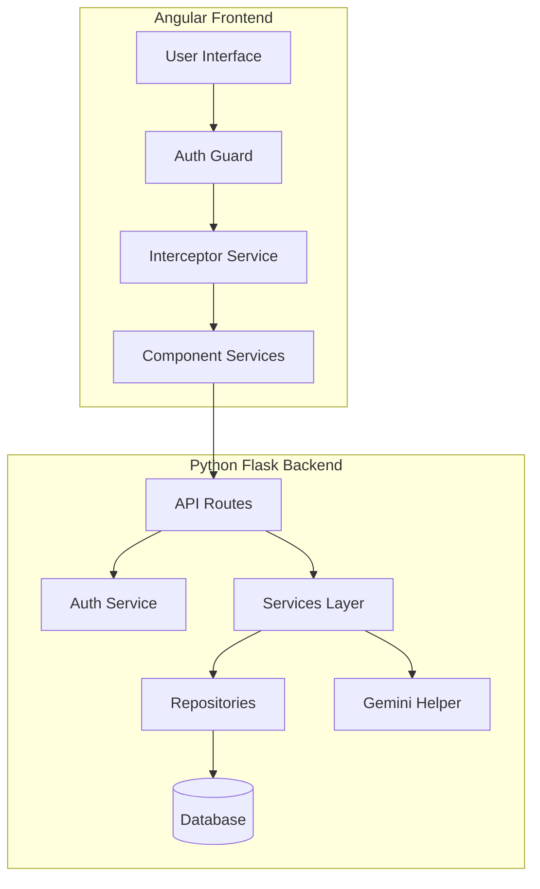
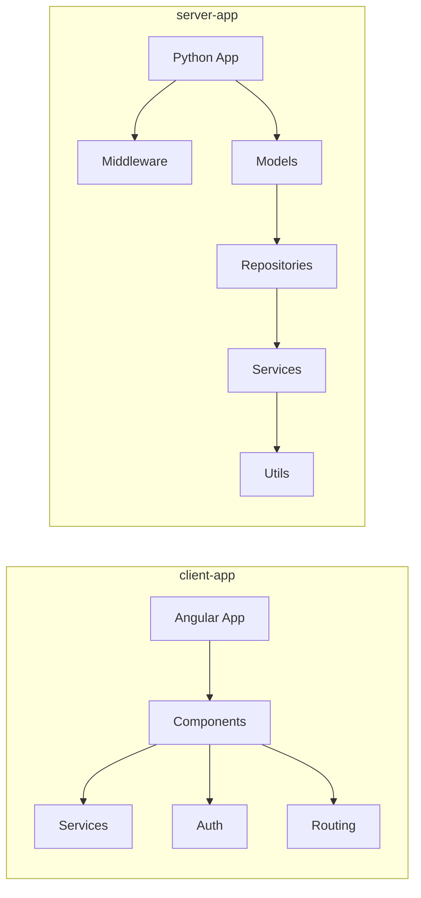
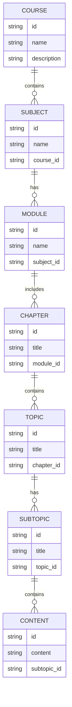

# CourseWagon 🚂

A modern, full-stack course management system built with Angular and Python Flask.

## 📋 Table of Contents
- [Overview](#overview)
- [Architecture](#architecture)
- [Features](#features)
- [Tech Stack](#tech-stack)
- [Project Structure](#project-structure)
- [Installation](#installation)
- [Running the Application](#running-the-application)
- [API Documentation](#api-documentation)
- [Contributing](#contributing)

## 🎯 Overview

CourseWagon is a comprehensive learning management system that allows educational institutions to manage and deliver courses, modules, and content efficiently. The platform supports hierarchical content organization with subjects, modules, chapters, topics, subtopics, and content management.

## 🏗 Architecture



## ✨ Features

- User Authentication and Authorization
- Course Management
- Subject and Module Organization
- Chapter and Topic Management
- Content Delivery
- Mermaid Diagram Support
- AI Integration with Google Gemini

## 🛠 Tech Stack

### Frontend
- Angular
- Angular Material
- TypeScript
- Firebase Integration
- Mermaid.js

### Backend
- Python Flask
- SQLAlchemy ORM
- JWT Authentication
- Google Gemini AI Integration

## 📁 Project Structure



## 🚀 Installation

### Frontend Setup
```bash
cd client-app
npm install
```

### Backend Setup
```bash
cd server-app
python -m venv venv
source venv/bin/activate  # On Windows: venv\Scripts\activate
pip install -r requirements.txt
```

## 🏃‍♂️ Running the Application

### Frontend
```bash
cd client-app
ng serve
```
The application will be available at `http://localhost:4200`

### Backend
```bash
cd server-app
python app.py
```
The API server will start at `http://localhost:5000`

## 📚 API Documentation

### Authentication Endpoints
- POST /api/auth/register - User registration 
- POST /api/auth/login - User login
- GET /api/auth/profile - Get user profile

### Course Management
- GET /api/courses - List all courses
- POST /api/courses - Create new course
- GET /api/courses/{id} - Get course details
- PUT /api/courses/{id} - Update course
- DELETE /api/courses/{id} - Delete course

### Content Hierarchy


## 🤝 Contributing

1. Fork the repository
2. Create a new branch (`git checkout -b feature/improvement`)
3. Make changes
4. Commit (`git commit -am 'Add new feature'`)
5. Push (`git push origin feature/improvement`)
6. Create Pull Request
---

Built with ❤️ using Angular and Flask