# CourseWagon System Architecture Documentation

## Table of Contents
1. [High-Level System Architecture](#1-high-level-system-architecture)
2. [Frontend Architecture](#2-frontend-architecture-angular-19)
3. [Backend Architecture](#3-backend-architecture-fastapi--python)
4. [Database Architecture](#4-database-architecture-mysql--sqlalchemy)
5. [Authentication & Authorization Flow](#5-authentication--authorization-flow)
6. [AI Content Generation Flow](#6-ai-content-generation-flow)
7. [Multi-Cloud Storage Architecture](#7-multi-cloud-storage-architecture)
8. [Email Notification System](#8-email-notification-system)
9. [Deployment Architecture](#9-deployment-architecture)
10. [Complete Data Flow](#10-complete-data-flow-end-to-end)
11. [Security Architecture](#11-security-architecture)
12. [Performance Optimizations](#12-performance-optimizations)

---

## 1. High-Level System Architecture

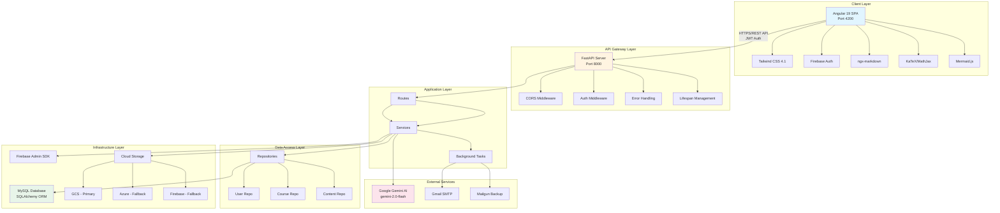
```mermaid
graph TB
    subgraph "Client Layer"
        A[Angular 19 SPA<br/>Port 4200]
        A1[Tailwind CSS 4.1]
        A2[Firebase Auth]
        A3[ngx-markdown]
        A4[KaTeX/MathJax]
        A5[Mermaid.js]
        A --> A1 & A2 & A3 & A4 & A5
    end

    subgraph "API Gateway Layer"
        B[FastAPI Server<br/>Port 8000]
        B1[CORS Middleware]
        B2[Auth Middleware]
        B3[Error Handling]
        B4[Lifespan Management]
        B --> B1 & B2 & B3 & B4
    end

    subgraph "Application Layer"
        C[Routes]
        D[Services]
        E[Background Tasks]
        C --> D
        D --> E
    end

    subgraph "Data Access Layer"
        F[Repositories]
        F1[User Repo]
        F2[Course Repo]
        F3[Content Repo]
        F --> F1 & F2 & F3
    end

    subgraph "Infrastructure Layer"
        G[MySQL Database<br/>SQLAlchemy ORM]
        H[Firebase Admin SDK]
        I[Cloud Storage]
        I1[GCS - Primary]
        I2[Azure - Fallback]
        I3[Firebase - Fallback]
        I --> I1 & I2 & I3
    end

    subgraph "External Services"
        J[Google Gemini AI<br/>gemini-2.0-flash]
        K[Gmail SMTP]
        L[Mailgun Backup]
    end

    A -->|HTTPS/REST API<br/>JWT Auth| B
    B --> C
    C --> D
    D --> F
    F --> G
    D --> H
    D --> I
    D --> J
    E --> K
    E --> L

    style A fill:#e1f5ff
    style B fill:#fff4e1
    style G fill:#e8f5e9
    style J fill:#fce4ec
```

### Technology Stack Overview

**Frontend:**
- Framework: Angular 19
- Styling: Tailwind CSS 4.1
- Authentication: Firebase Auth
- Markdown: ngx-markdown with Prism.js
- Math: KaTeX, MathJax
- Diagrams: Mermaid.js
- Icons: Font Awesome

**Backend:**
- Framework: FastAPI (Python)
- Database: MySQL with SQLAlchemy ORM
- AI: Google Gemini AI (gemini-2.0-flash)
- Storage: Azure Blob Storage, Firebase Storage, Google Cloud Storage
- Auth: JWT tokens with Firebase Admin SDK
- Email: Gmail SMTP, Mailgun (backup)

**Deployment:**
- Frontend: Firebase Hosting (www.coursewagon.live)
- Backend: Google Cloud Run / Azure Container Apps
- CI/CD: GitHub Actions

---

## 2. Frontend Architecture (Angular 19)

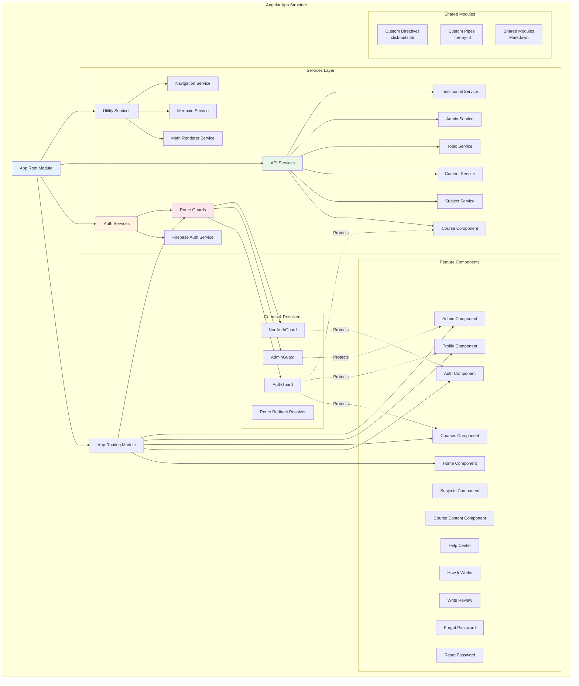
```mermaid
graph TB
    subgraph "Angular App Structure"
        ROOT[App Root Module]
        ROUTING[App Routing Module]

        subgraph "Services Layer"
            AUTH_SVC[Auth Services]
            API_SVC[API Services]
            UTIL_SVC[Utility Services]

            AUTH_SVC --> FIREBASE[Firebase Auth Service]
            AUTH_SVC --> GUARDS[Route Guards]

            API_SVC --> COURSE[Course Service]
            API_SVC --> SUBJECT[Subject Service]
            API_SVC --> CONTENT[Content Service]
            API_SVC --> TOPIC[Topic Service]
            API_SVC --> ADMIN[Admin Service]
            API_SVC --> TESTIMONIAL[Testimonial Service]

            UTIL_SVC --> MATH[Math Renderer Service]
            UTIL_SVC --> MERMAID[Mermaid Service]
            UTIL_SVC --> NAV[Navigation Service]
        end

        subgraph "Feature Components"
            HOME[Home Component]
            AUTH_COMP[Auth Component]
            COURSES[Courses Component]
            COURSE[Course Component]
            SUBJECTS[Subjects Component]
            CONTENT_VIEW[Course Content Component]
            PROFILE[Profile Component]
            ADMIN_COMP[Admin Component]
            HELP[Help Center]
            HOW[How It Works]
            REVIEW[Write Review]
            FORGOT[Forgot Password]
            RESET[Reset Password]
        end

        subgraph "Guards & Resolvers"
            AUTH_GUARD[AuthGuard]
            ADMIN_GUARD[AdminGuard]
            NON_AUTH_GUARD[NonAuthGuard]
            RESOLVER[Route Redirect Resolver]
        end

        subgraph "Shared Modules"
            DIRECTIVES[Custom Directives<br/>click-outside]
            PIPES[Custom Pipes<br/>filter-by-id]
            SHARED[Shared Modules<br/>Markdown]
        end

        ROOT --> ROUTING
        ROUTING --> GUARDS
        ROOT --> AUTH_SVC
        ROOT --> API_SVC
        ROOT --> UTIL_SVC

        GUARDS --> AUTH_GUARD
        GUARDS --> ADMIN_GUARD
        GUARDS --> NON_AUTH_GUARD

        ROUTING --> HOME & AUTH_COMP & COURSES & PROFILE & ADMIN_COMP

        AUTH_GUARD -.->|Protects| COURSES & PROFILE & COURSE
        ADMIN_GUARD -.->|Protects| ADMIN_COMP
        NON_AUTH_GUARD -.->|Protects| AUTH_COMP
    end

    style ROOT fill:#e3f2fd
    style AUTH_SVC fill:#fff3e0
    style API_SVC fill:#e8f5e9
    style GUARDS fill:#fce4ec
```

### Frontend Component Hierarchy

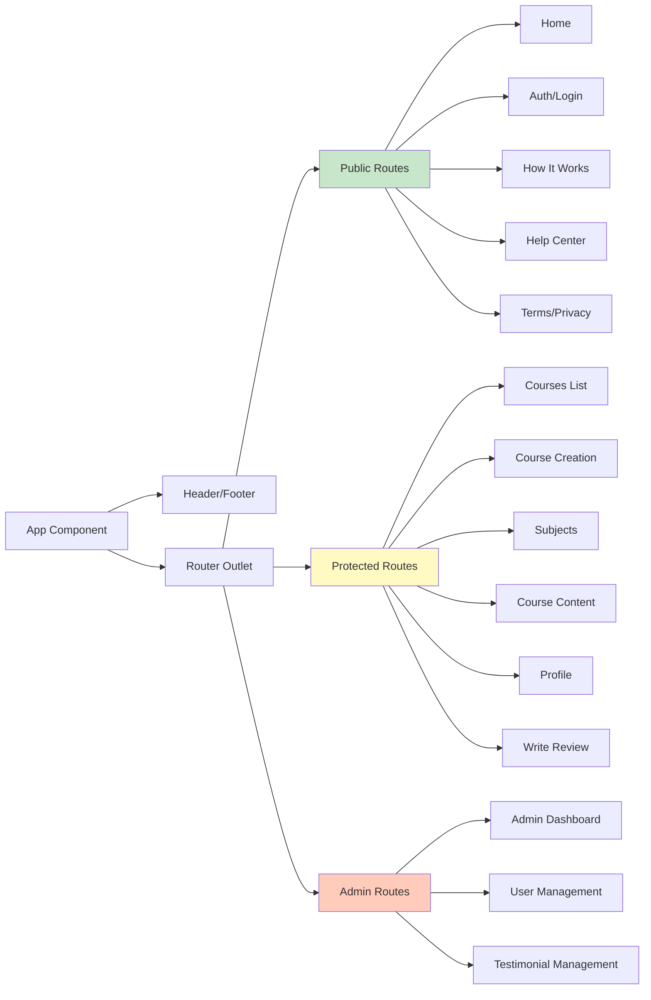
```mermaid
graph LR
    A[App Component] --> B[Header/Footer]
    A --> C[Router Outlet]

    C --> D[Public Routes]
    C --> E[Protected Routes]
    C --> F[Admin Routes]

    D --> D1[Home]
    D --> D2[Auth/Login]
    D --> D3[How It Works]
    D --> D4[Help Center]
    D --> D5[Terms/Privacy]

    E --> E1[Courses List]
    E --> E2[Course Creation]
    E --> E3[Subjects]
    E --> E4[Course Content]
    E --> E5[Profile]
    E --> E6[Write Review]

    F --> F1[Admin Dashboard]
    F --> F2[User Management]
    F --> F3[Testimonial Management]

    style D fill:#c8e6c9
    style E fill:#fff9c4
    style F fill:#ffccbc
```

---

## 3. Backend Architecture (FastAPI + Python)

```mermaid
graph TB
    subgraph "FastAPI Application"
        APP[app.py<br/>FastAPI Entry Point]
        LIFESPAN[Lifespan Manager<br/>Startup/Shutdown]
        MIDDLEWARE[Middleware Stack]

        APP --> LIFESPAN
        APP --> MIDDLEWARE

        MIDDLEWARE --> CORS[CORS Middleware]
        MIDDLEWARE --> AUTH_MW[Auth Middleware]
        MIDDLEWARE --> ERROR[Error Handler]
    end

    subgraph "Routes Layer - API Endpoints"
        R1[auth_routes.py<br/>/api/auth/*]
        R2[course_routes.py<br/>/api/courses/*]
        R3[subject_routes.py<br/>/api/subjects/*]
        R4[chapter_routes.py<br/>/api/chapters/*]
        R5[topic_routes.py<br/>/api/topics/*]
        R6[content_routes.py<br/>/api/content/*]
        R7[testimonial_routes.py<br/>/api/testimonials/*]
        R8[image_routes.py<br/>/api/images/*]
        R9[admin/routes.py<br/>/api/admin/*]
        R10[utility_routes.py<br/>/api/utility/*]
    end

    subgraph "Services Layer - Business Logic"
        S1[auth_service.py]
        S2[course_service.py]
        S3[subject_service.py]
        S4[content_service.py]
        S5[topic_service.py]
        S6[testimonial_service.py]
        S7[image_service.py]
        S8[email_service.py]
        S9[firebase_admin_service.py]
        S10[background_task_service.py]
    end

    subgraph "Repositories Layer - Data Access"
        RP1[user_repository.py]
        RP2[course_repo.py]
        RP3[subject_repo.py]
        RP4[content_repo.py]
        RP5[topic_repo.py]
        RP6[testimonial_repo.py]
        RP7[password_reset_repository.py]
    end

    subgraph "Models Layer - SQLAlchemy ORM"
        M1[user.py]
        M2[course.py]
        M3[subject.py]
        M4[chapter.py]
        M5[topic.py]
        M6[content.py]
        M7[testimonial.py]
        M8[password_reset.py]
    end

    subgraph "Utilities"
        U1[gemini_helper.py<br/>AI Integration]
        U2[unified_storage_helper.py<br/>Cloud Storage]
        U3[gcs_storage_helper.py<br/>Google Cloud Storage]
        U4[azure_storage_helper.py<br/>Azure Blob Storage]
        U5[firebase_helper.py<br/>Firebase Storage]
        U6[encryption.py<br/>Data Encryption]
    end

    APP --> R1 & R2 & R3 & R4 & R5 & R6 & R7 & R8 & R9 & R10

    R1 --> S1
    R2 --> S2
    R3 --> S3
    R6 --> S4
    R5 --> S5
    R8 --> S7

    S1 --> RP1
    S2 --> RP2
    S3 --> RP3
    S4 --> RP4
    S5 --> RP5

    RP1 --> M1
    RP2 --> M2
    RP3 --> M3
    RP4 --> M6
    RP5 --> M5

    S2 & S3 & S4 --> U1
    S7 --> U2
    U2 --> U3 & U4 & U5

    style APP fill:#e3f2fd
    style S1 fill:#fff3e0
    style RP1 fill:#e8f5e9
    style M1 fill:#f3e5f5
    style U1 fill:#ffebee
```

### Layered Architecture Pattern

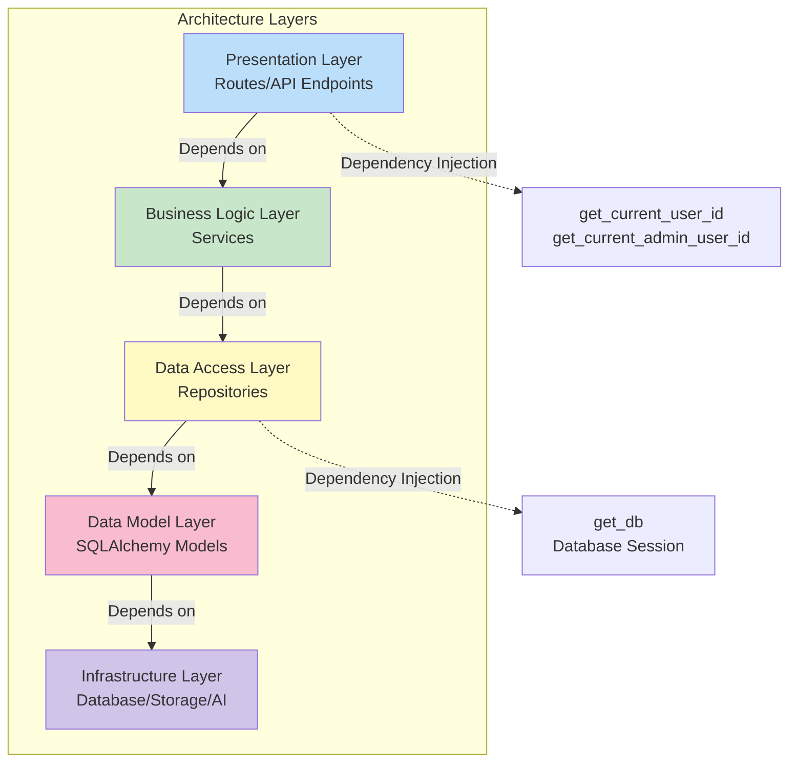
```mermaid
graph TB
    subgraph "Architecture Layers"
        L1[Presentation Layer<br/>Routes/API Endpoints]
        L2[Business Logic Layer<br/>Services]
        L3[Data Access Layer<br/>Repositories]
        L4[Data Model Layer<br/>SQLAlchemy Models]
        L5[Infrastructure Layer<br/>Database/Storage/AI]
    end

    L1 -->|Depends on| L2
    L2 -->|Depends on| L3
    L3 -->|Depends on| L4
    L4 -->|Depends on| L5

    L1 -.->|Dependency Injection| AUTH_DEP[get_current_user_id<br/>get_current_admin_user_id]
    L3 -.->|Dependency Injection| DB_DEP[get_db<br/>Database Session]

    style L1 fill:#bbdefb
    style L2 fill:#c8e6c9
    style L3 fill:#fff9c4
    style L4 fill:#f8bbd0
    style L5 fill:#d1c4e9
```

### Database Connection Pooling

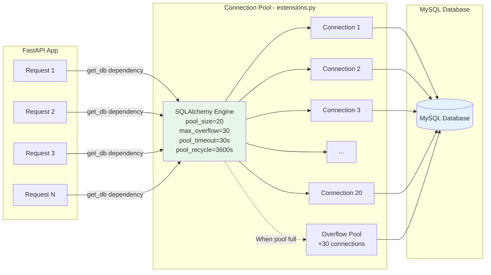
```mermaid
graph LR
    subgraph "FastAPI App"
        REQ1[Request 1]
        REQ2[Request 2]
        REQ3[Request 3]
        REQ_N[Request N]
    end

    subgraph "Connection Pool - extensions.py"
        POOL[SQLAlchemy Engine<br/>pool_size=20<br/>max_overflow=30<br/>pool_timeout=30s<br/>pool_recycle=3600s]

        C1[Connection 1]
        C2[Connection 2]
        C3[Connection 3]
        C_DOTS[...]
        C20[Connection 20]

        OVERFLOW[Overflow Pool<br/>+30 connections]
    end

    subgraph "MySQL Database"
        DB[(MySQL Database)]
    end

    REQ1 & REQ2 & REQ3 & REQ_N -->|get_db dependency| POOL
    POOL --> C1 & C2 & C3 & C_DOTS & C20
    POOL -.->|When pool full| OVERFLOW
    C1 & C2 & C3 & C20 & OVERFLOW --> DB

    style POOL fill:#e8f5e9
    style DB fill:#e3f2fd
```

---

## 4. Database Architecture (MySQL + SQLAlchemy)

### Entity Relationship Diagram

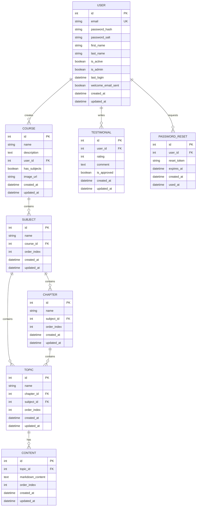
```mermaid
erDiagram
    USER ||--o{ COURSE : creates
    USER ||--o{ TESTIMONIAL : writes
    USER ||--o{ PASSWORD_RESET : requests

    COURSE ||--o{ SUBJECT : contains
    SUBJECT ||--o{ CHAPTER : contains
    SUBJECT ||--o{ TOPIC : contains
    CHAPTER ||--o{ TOPIC : contains
    TOPIC ||--o{ CONTENT : has

    USER {
        int id PK
        string email UK
        string password_hash
        string password_salt
        string first_name
        string last_name
        boolean is_active
        boolean is_admin
        datetime last_login
        boolean welcome_email_sent
        datetime created_at
        datetime updated_at
    }

    COURSE {
        int id PK
        string name
        text description
        int user_id FK
        boolean has_subjects
        string image_url
        datetime created_at
        datetime updated_at
    }

    SUBJECT {
        int id PK
        string name
        int course_id FK
        int order_index
        datetime created_at
        datetime updated_at
    }

    CHAPTER {
        int id PK
        string name
        int subject_id FK
        int order_index
        datetime created_at
        datetime updated_at
    }

    TOPIC {
        int id PK
        string name
        int chapter_id FK
        int subject_id FK
        int order_index
        datetime created_at
        datetime updated_at
    }

    CONTENT {
        int id PK
        int topic_id FK
        text markdown_content
        int order_index
        datetime created_at
        datetime updated_at
    }

    TESTIMONIAL {
        int id PK
        int user_id FK
        int rating
        text comment
        boolean is_approved
        datetime created_at
        datetime updated_at
    }

    PASSWORD_RESET {
        int id PK
        int user_id FK
        string reset_token
        datetime expires_at
        datetime created_at
        datetime used_at
    }
```

### Data Hierarchy Flow

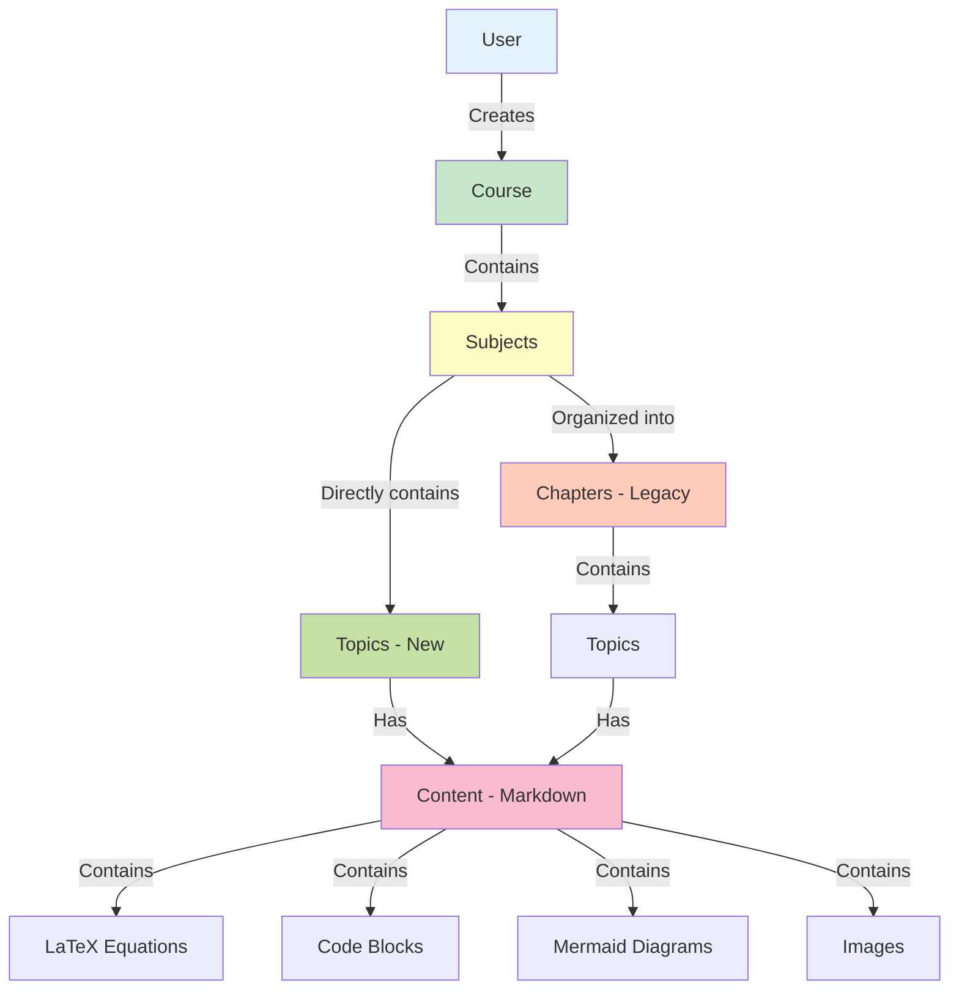
```mermaid
graph TD
    A[User] -->|Creates| B[Course]
    B -->|Contains| C[Subjects]
    C -->|Organized into| D[Chapters - Legacy]
    C -->|Directly contains| E[Topics - New]
    D -->|Contains| F[Topics]
    E & F -->|Has| G[Content - Markdown]

    G -->|Contains| G1[LaTeX Equations]
    G -->|Contains| G2[Code Blocks]
    G -->|Contains| G3[Mermaid Diagrams]
    G -->|Contains| G4[Images]

    style A fill:#e3f2fd
    style B fill:#c8e6c9
    style C fill:#fff9c4
    style D fill:#ffccbc
    style E fill:#c5e1a5
    style G fill:#f8bbd0
```

### Database Session Management

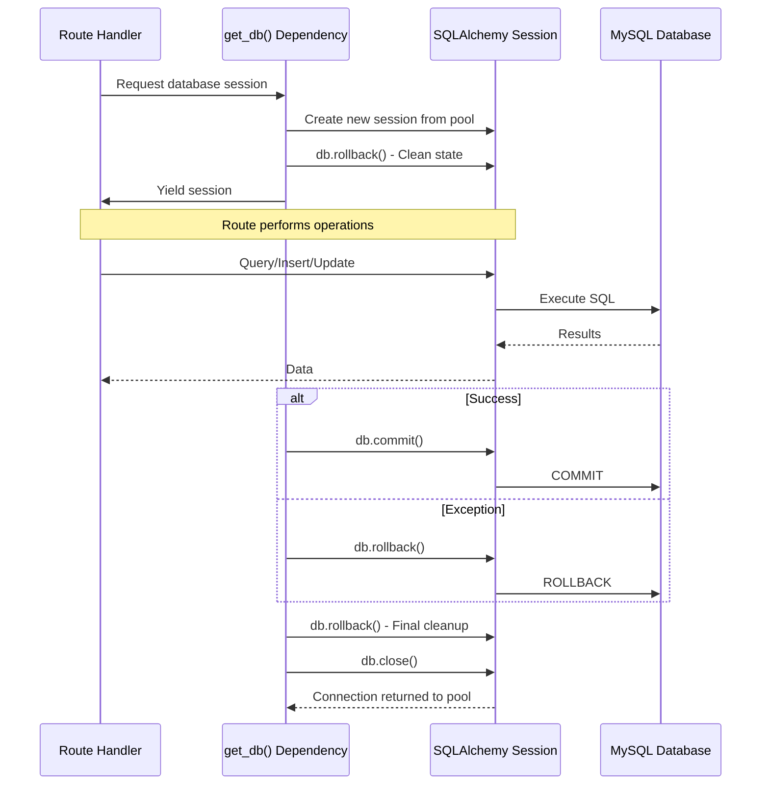
```mermaid
sequenceDiagram
    participant Route as Route Handler
    participant Dep as get_db() Dependency
    participant Session as SQLAlchemy Session
    participant DB as MySQL Database

    Route->>Dep: Request database session
    Dep->>Session: Create new session from pool
    Dep->>Session: db.rollback() - Clean state
    Dep->>Route: Yield session

    Note over Route,Session: Route performs operations
    Route->>Session: Query/Insert/Update
    Session->>DB: Execute SQL
    DB-->>Session: Results
    Session-->>Route: Data

    alt Success
        Dep->>Session: db.commit()
        Session->>DB: COMMIT
    else Exception
        Dep->>Session: db.rollback()
        Session->>DB: ROLLBACK
    end

    Dep->>Session: db.rollback() - Final cleanup
    Dep->>Session: db.close()
    Session-->>Dep: Connection returned to pool
```

---

## 5. Authentication & Authorization Flow

### User Registration & Login

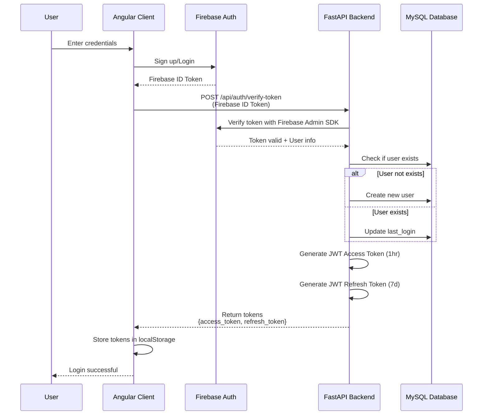
```mermaid
sequenceDiagram
    participant User
    participant Angular as Angular Client
    participant Firebase as Firebase Auth
    participant FastAPI as FastAPI Backend
    participant MySQL as MySQL Database

    User->>Angular: Enter credentials
    Angular->>Firebase: Sign up/Login
    Firebase-->>Angular: Firebase ID Token

    Angular->>FastAPI: POST /api/auth/verify-token<br/>(Firebase ID Token)

    FastAPI->>Firebase: Verify token with Firebase Admin SDK
    Firebase-->>FastAPI: Token valid + User info

    FastAPI->>MySQL: Check if user exists
    alt User not exists
        FastAPI->>MySQL: Create new user
    else User exists
        FastAPI->>MySQL: Update last_login
    end

    FastAPI->>FastAPI: Generate JWT Access Token (1hr)
    FastAPI->>FastAPI: Generate JWT Refresh Token (7d)

    FastAPI-->>Angular: Return tokens<br/>{access_token, refresh_token}
    Angular->>Angular: Store tokens in localStorage

    Angular-->>User: Login successful
```

### Authenticated API Request

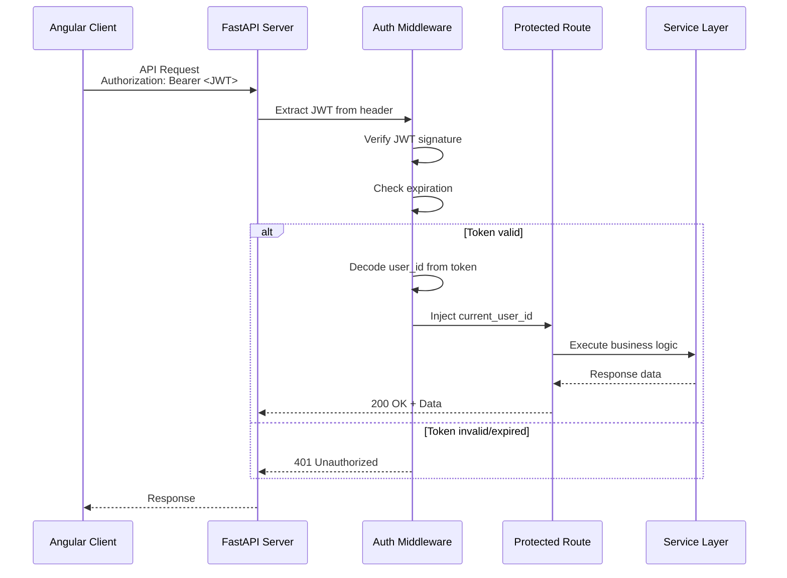
```mermaid
sequenceDiagram
    participant Angular as Angular Client
    participant FastAPI as FastAPI Server
    participant Middleware as Auth Middleware
    participant Route as Protected Route
    participant Service as Service Layer

    Angular->>FastAPI: API Request<br/>Authorization: Bearer <JWT>

    FastAPI->>Middleware: Extract JWT from header
    Middleware->>Middleware: Verify JWT signature
    Middleware->>Middleware: Check expiration

    alt Token valid
        Middleware->>Middleware: Decode user_id from token
        Middleware->>Route: Inject current_user_id
        Route->>Service: Execute business logic
        Service-->>Route: Response data
        Route-->>FastAPI: 200 OK + Data
    else Token invalid/expired
        Middleware-->>FastAPI: 401 Unauthorized
    end

    FastAPI-->>Angular: Response
```

### Admin Authorization

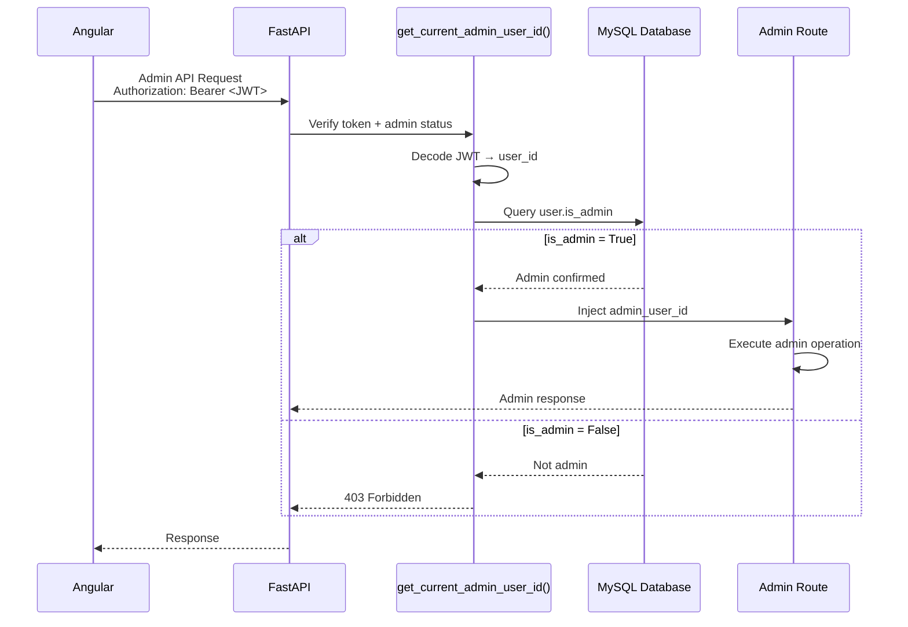
```mermaid
sequenceDiagram
    participant Angular
    participant FastAPI
    participant Auth as get_current_admin_user_id()
    participant DB as MySQL Database
    participant Route as Admin Route

    Angular->>FastAPI: Admin API Request<br/>Authorization: Bearer <JWT>

    FastAPI->>Auth: Verify token + admin status
    Auth->>Auth: Decode JWT → user_id
    Auth->>DB: Query user.is_admin

    alt is_admin = True
        DB-->>Auth: Admin confirmed
        Auth->>Route: Inject admin_user_id
        Route->>Route: Execute admin operation
        Route-->>FastAPI: Admin response
    else is_admin = False
        DB-->>Auth: Not admin
        Auth-->>FastAPI: 403 Forbidden
    end

    FastAPI-->>Angular: Response
```

### JWT Token Structure

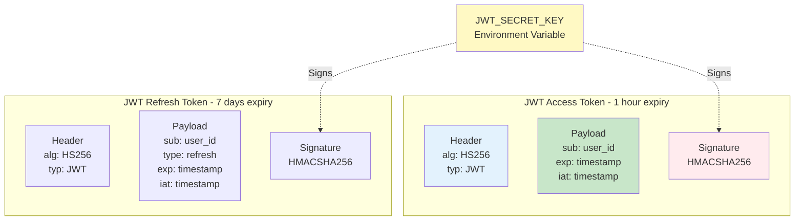
```mermaid
graph TB
    subgraph "JWT Access Token - 1 hour expiry"
        HEADER[Header<br/>alg: HS256<br/>typ: JWT]
        PAYLOAD[Payload<br/>sub: user_id<br/>exp: timestamp<br/>iat: timestamp]
        SIGNATURE[Signature<br/>HMACSHA256]
    end

    subgraph "JWT Refresh Token - 7 days expiry"
        HEADER2[Header<br/>alg: HS256<br/>typ: JWT]
        PAYLOAD2[Payload<br/>sub: user_id<br/>type: refresh<br/>exp: timestamp<br/>iat: timestamp]
        SIGNATURE2[Signature<br/>HMACSHA256]
    end

    SECRET[JWT_SECRET_KEY<br/>Environment Variable]

    SECRET -.->|Signs| SIGNATURE
    SECRET -.->|Signs| SIGNATURE2

    style HEADER fill:#e3f2fd
    style PAYLOAD fill:#c8e6c9
    style SIGNATURE fill:#ffebee
    style SECRET fill:#fff9c4
```

---

## 6. AI Content Generation Flow

### Course Subject Generation

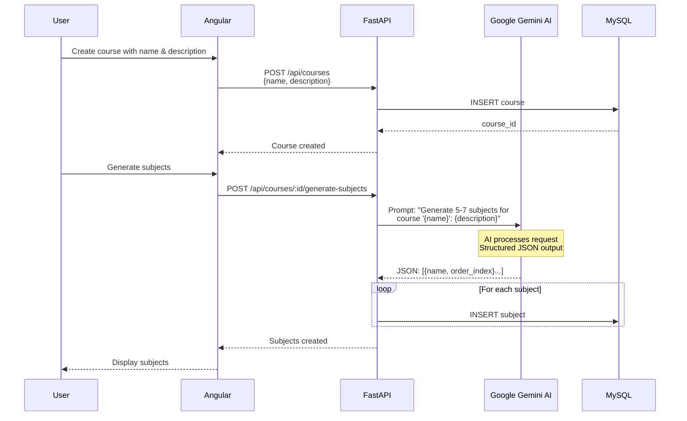
```mermaid
sequenceDiagram
    participant User
    participant Angular
    participant FastAPI
    participant Gemini as Google Gemini AI
    participant MySQL

    User->>Angular: Create course with name & description
    Angular->>FastAPI: POST /api/courses<br/>{name, description}
    FastAPI->>MySQL: INSERT course
    MySQL-->>FastAPI: course_id
    FastAPI-->>Angular: Course created

    User->>Angular: Generate subjects
    Angular->>FastAPI: POST /api/courses/:id/generate-subjects

    FastAPI->>Gemini: Prompt: "Generate 5-7 subjects for<br/>course '{name}': {description}"
    Note over Gemini: AI processes request<br/>Structured JSON output

    Gemini-->>FastAPI: JSON: [{name, order_index}...]

    loop For each subject
        FastAPI->>MySQL: INSERT subject
    end

    FastAPI-->>Angular: Subjects created
    Angular-->>User: Display subjects
```

### Topic Generation for Subject

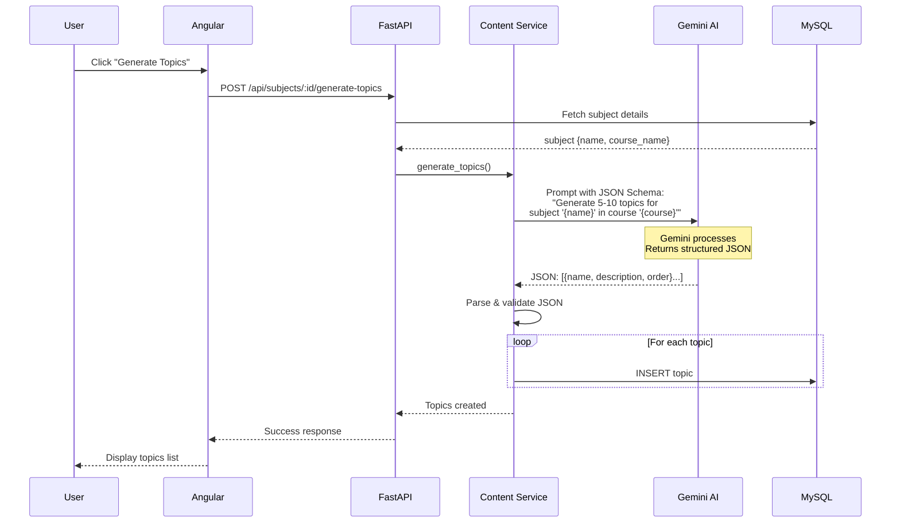
```mermaid
sequenceDiagram
    participant User
    participant Angular
    participant FastAPI
    participant Service as Content Service
    participant Gemini as Gemini AI
    participant MySQL

    User->>Angular: Click "Generate Topics"
    Angular->>FastAPI: POST /api/subjects/:id/generate-topics

    FastAPI->>MySQL: Fetch subject details
    MySQL-->>FastAPI: subject {name, course_name}

    FastAPI->>Service: generate_topics()
    Service->>Gemini: Prompt with JSON Schema:<br/>"Generate 5-10 topics for<br/>subject '{name}' in course '{course}'"

    Note over Gemini: Gemini processes<br/>Returns structured JSON

    Gemini-->>Service: JSON: [{name, description, order}...]

    Service->>Service: Parse & validate JSON

    loop For each topic
        Service->>MySQL: INSERT topic
    end

    Service-->>FastAPI: Topics created
    FastAPI-->>Angular: Success response
    Angular-->>User: Display topics list
```

### Detailed Content Generation

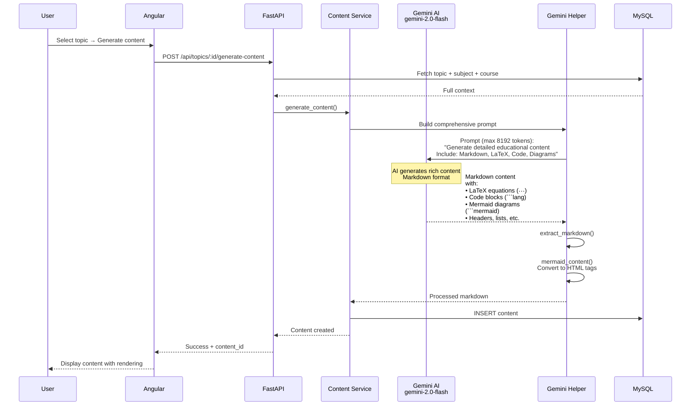
```mermaid
sequenceDiagram
    participant User
    participant Angular
    participant FastAPI
    participant Service as Content Service
    participant Gemini as Gemini AI<br/>gemini-2.0-flash
    participant Helper as Gemini Helper
    participant MySQL

    User->>Angular: Select topic → Generate content
    Angular->>FastAPI: POST /api/topics/:id/generate-content

    FastAPI->>MySQL: Fetch topic + subject + course
    MySQL-->>FastAPI: Full context

    FastAPI->>Service: generate_content()
    Service->>Helper: Build comprehensive prompt

    Helper->>Gemini: Prompt (max 8192 tokens):<br/>"Generate detailed educational content<br/>Include: Markdown, LaTeX, Code, Diagrams"

    Note over Gemini: AI generates rich content<br/>Markdown format

    Gemini-->>Helper: Markdown content with:<br/>• LaTeX equations ($$...$$)<br/>• Code blocks (```lang)<br/>• Mermaid diagrams (```mermaid)<br/>• Headers, lists, etc.

    Helper->>Helper: extract_markdown()
    Helper->>Helper: mermaid_content()<br/>Convert to HTML tags

    Helper-->>Service: Processed markdown
    Service->>MySQL: INSERT content

    Service-->>FastAPI: Content created
    FastAPI-->>Angular: Success + content_id
    Angular-->>User: Display content with rendering
```

### AI Image Generation (Optional)

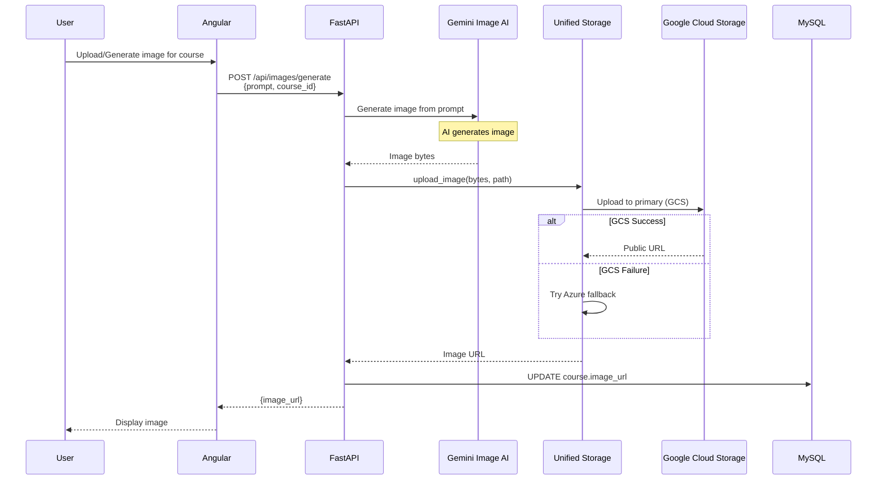
```mermaid
sequenceDiagram
    participant User
    participant Angular
    participant FastAPI
    participant Gemini as Gemini Image AI
    participant Storage as Unified Storage
    participant GCS as Google Cloud Storage
    participant MySQL

    User->>Angular: Upload/Generate image for course
    Angular->>FastAPI: POST /api/images/generate<br/>{prompt, course_id}

    FastAPI->>Gemini: Generate image from prompt
    Note over Gemini: AI generates image
    Gemini-->>FastAPI: Image bytes

    FastAPI->>Storage: upload_image(bytes, path)
    Storage->>GCS: Upload to primary (GCS)

    alt GCS Success
        GCS-->>Storage: Public URL
    else GCS Failure
        Storage->>Storage: Try Azure fallback
    end

    Storage-->>FastAPI: Image URL
    FastAPI->>MySQL: UPDATE course.image_url

    FastAPI-->>Angular: {image_url}
    Angular-->>User: Display image
```

### Content Rendering Pipeline

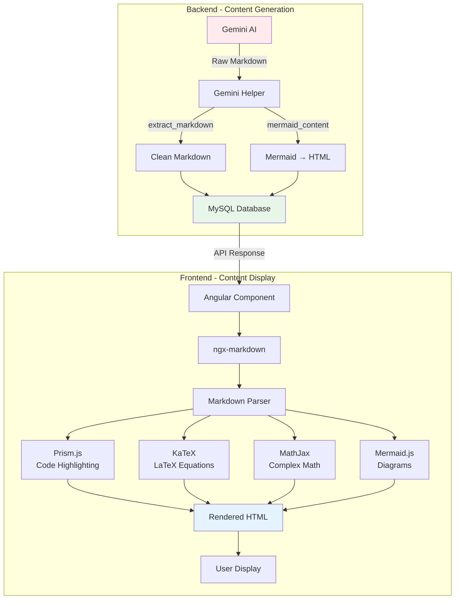
```mermaid
graph TB
    subgraph "Backend - Content Generation"
        A[Gemini AI] -->|Raw Markdown| B[Gemini Helper]
        B -->|extract_markdown| C[Clean Markdown]
        B -->|mermaid_content| D[Mermaid → HTML]
        C & D --> E[MySQL Database]
    end

    subgraph "Frontend - Content Display"
        E -->|API Response| F[Angular Component]
        F --> G[ngx-markdown]

        G --> H[Markdown Parser]
        H --> I[Prism.js<br/>Code Highlighting]
        H --> J[KaTeX<br/>LaTeX Equations]
        H --> K[MathJax<br/>Complex Math]
        H --> L[Mermaid.js<br/>Diagrams]

        I & J & K & L --> M[Rendered HTML]
        M --> N[User Display]
    end

    style A fill:#ffebee
    style E fill:#e8f5e9
    style M fill:#e3f2fd
```

---

## 7. Multi-Cloud Storage Architecture

### Unified Storage Abstraction

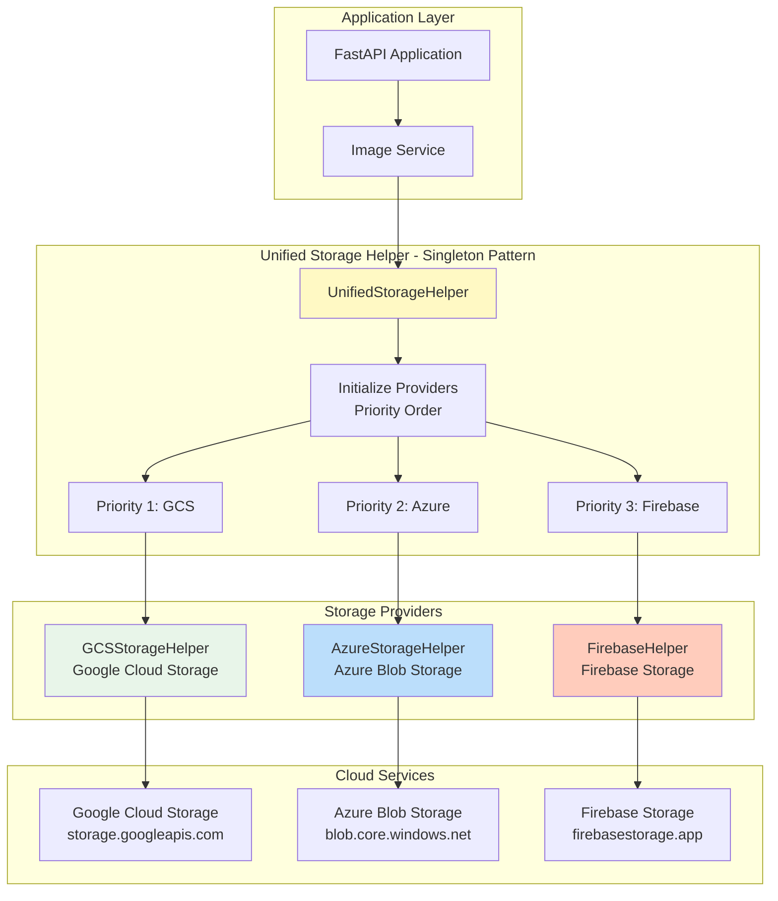
```mermaid
graph TB
    subgraph "Application Layer"
        APP[FastAPI Application]
        IMAGE_SVC[Image Service]
    end

    subgraph "Unified Storage Helper - Singleton Pattern"
        UNIFIED[UnifiedStorageHelper]
        INIT[Initialize Providers<br/>Priority Order]

        UNIFIED --> INIT

        INIT --> P1[Priority 1: GCS]
        INIT --> P2[Priority 2: Azure]
        INIT --> P3[Priority 3: Firebase]
    end

    subgraph "Storage Providers"
        GCS[GCSStorageHelper<br/>Google Cloud Storage]
        AZURE[AzureStorageHelper<br/>Azure Blob Storage]
        FIREBASE[FirebaseHelper<br/>Firebase Storage]
    end

    subgraph "Cloud Services"
        GCS_CLOUD[Google Cloud Storage<br/>storage.googleapis.com]
        AZURE_CLOUD[Azure Blob Storage<br/>blob.core.windows.net]
        FIREBASE_CLOUD[Firebase Storage<br/>firebasestorage.app]
    end

    APP --> IMAGE_SVC
    IMAGE_SVC --> UNIFIED

    P1 --> GCS
    P2 --> AZURE
    P3 --> FIREBASE

    GCS --> GCS_CLOUD
    AZURE --> AZURE_CLOUD
    FIREBASE --> FIREBASE_CLOUD

    style UNIFIED fill:#fff9c4
    style GCS fill:#e8f5e9
    style AZURE fill:#bbdefb
    style FIREBASE fill:#ffccbc
```

### Storage Failover Flow

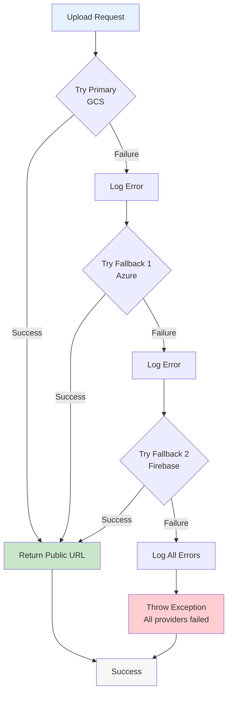
```mermaid
flowchart TD
    START[Upload Request] --> TRY_PRIMARY{Try Primary<br/>GCS}

    TRY_PRIMARY -->|Success| RETURN_URL[Return Public URL]
    TRY_PRIMARY -->|Failure| LOG1[Log Error]

    LOG1 --> TRY_FALLBACK1{Try Fallback 1<br/>Azure}

    TRY_FALLBACK1 -->|Success| RETURN_URL
    TRY_FALLBACK1 -->|Failure| LOG2[Log Error]

    LOG2 --> TRY_FALLBACK2{Try Fallback 2<br/>Firebase}

    TRY_FALLBACK2 -->|Success| RETURN_URL
    TRY_FALLBACK2 -->|Failure| LOG3[Log All Errors]

    LOG3 --> THROW_ERROR[Throw Exception<br/>All providers failed]

    RETURN_URL --> END[Success]
    THROW_ERROR --> END

    style START fill:#e3f2fd
    style RETURN_URL fill:#c8e6c9
    style THROW_ERROR fill:#ffcdd2
    style END fill:#f5f5f5
```

### Image Upload Sequence

```mermaid
sequenceDiagram
    participant Client
    participant API as FastAPI
    participant Storage as UnifiedStorageHelper
    participant GCS as Google Cloud Storage
    participant Azure as Azure Blob Storage
    participant DB as MySQL

    Client->>API: POST /api/images/upload<br/>multipart/form-data
    API->>API: Validate image (size, type)
    API->>Storage: upload_image(bytes, path)

    Storage->>GCS: Attempt primary upload

    alt GCS Success
        GCS-->>Storage: URL: https://storage.googleapis.com/...
        Storage-->>API: Image URL
    else GCS Failure
        GCS--xStorage: Connection error
        Storage->>Azure: Attempt fallback upload

        alt Azure Success
            Azure-->>Storage: URL: https://...blob.core.windows.net/...
            Storage-->>API: Image URL
        else Azure Failure
            Azure--xStorage: Connection error
            Storage-->>API: Error: All providers failed
        end
    end

    API->>DB: Save image_url to course/content
    API-->>Client: {image_url}
```

### Storage Provider Detection

```mermaid
graph LR
    A[Image URL] --> B{Detect Provider}

    B -->|Contains<br/>storage.googleapis.com| C[Use GCS Helper]
    B -->|Contains<br/>blob.core.windows.net| D[Use Azure Helper]
    B -->|Contains<br/>firebasestorage.app| E[Use Firebase Helper]
    B -->|Unknown| F[Return Error]

    C --> G[Delete from GCS]
    D --> H[Delete from Azure]
    E --> I[Delete from Firebase]

    style B fill:#fff9c4
    style C fill:#e8f5e9
    style D fill:#bbdefb
    style E fill:#ffccbc
```

---

## 8. Email Notification System

### Email System Architecture

```mermaid
graph TB
    subgraph "Trigger Events"
        E1[User Registration]
        E2[Password Reset Request]
        E3[Welcome Email]
        E4[Admin Notifications]
    end

    subgraph "Background Task Service - APScheduler"
        BG[BackgroundTaskService]
        SCHEDULER[APScheduler]
        QUEUE[Task Queue]

        BG --> SCHEDULER
        SCHEDULER --> QUEUE
    end

    subgraph "Email Service Layer"
        EMAIL_SVC[EmailService]
        TEMPLATES[Jinja2 Templates]

        EMAIL_SVC --> TEMPLATES
        TEMPLATES --> T1[welcome.html]
        TEMPLATES --> T2[password_reset.html]
        TEMPLATES --> T3[notification.html]
    end

    subgraph "Email Providers"
        GMAIL[Gmail SMTP<br/>Primary]
        MAILGUN[Mailgun API<br/>Backup]
    end

    subgraph "Database"
        DB[(MySQL)]
    end

    E1 & E2 & E3 & E4 --> BG
    QUEUE --> EMAIL_SVC

    EMAIL_SVC --> GMAIL
    EMAIL_SVC -.->|Fallback| MAILGUN

    EMAIL_SVC --> DB
    DB -.->|Update flags<br/>welcome_email_sent| DB

    style BG fill:#fff9c4
    style EMAIL_SVC fill:#e3f2fd
    style GMAIL fill:#c8e6c9
```

### Email Sending Sequence

```mermaid
sequenceDiagram
    participant User
    participant API as FastAPI Route
    participant Auth as Auth Service
    participant BG as Background Task Service
    participant Email as Email Service
    participant SMTP as Gmail SMTP
    participant DB as MySQL

    User->>API: Register/Reset Password
    API->>Auth: Create user/reset token
    Auth->>DB: Save user/token

    Auth->>BG: send_email_async()<br/>{recipient, template, data}
    Note over BG: Non-blocking<br/>Returns immediately

    API-->>User: Success response

    par Background Processing
        BG->>Email: Render template
        Email->>Email: Load Jinja2 template
        Email->>Email: Inject data (name, link, etc.)
        Email-->>BG: HTML email body

        BG->>SMTP: Send email via SMTP

        alt SMTP Success
            SMTP-->>BG: Email sent
            BG->>DB: Update welcome_email_sent = True
        else SMTP Failure
            SMTP--xBG: Connection error
            BG->>BG: Retry or use Mailgun
        end
    end
```

### APScheduler Lifecycle

```mermaid
sequenceDiagram
    participant App as FastAPI App
    participant Lifespan as Lifespan Manager
    participant BG as BackgroundTaskService
    participant Scheduler as APScheduler

    App->>Lifespan: Application Startup
    Lifespan->>BG: Initialize service
    BG->>Scheduler: Create scheduler instance
    Scheduler->>Scheduler: Start scheduler
    BG-->>Lifespan: Service ready

    Note over App,Scheduler: Application Running<br/>Background tasks executing

    App->>Lifespan: Application Shutdown
    Lifespan->>BG: shutdown()
    BG->>Scheduler: Stop scheduler
    Scheduler->>Scheduler: Complete pending tasks
    Scheduler->>Scheduler: Cleanup
    BG-->>Lifespan: Shutdown complete
```

### Email Templates Structure

```mermaid
graph TB
    subgraph "Email Templates - Jinja2"
        BASE[base_email.html<br/>Base Template]

        WELCOME[welcome.html<br/>User Welcome]
        RESET[password_reset.html<br/>Reset Password]
        NOTIFY[notification.html<br/>General Notifications]

        BASE --> WELCOME
        BASE --> RESET
        BASE --> NOTIFY
    end

    subgraph "Template Variables"
        VAR1[user_name]
        VAR2[reset_link]
        VAR3[expiry_time]
        VAR4[support_email]
        VAR5[company_name]
    end

    WELCOME -.->|Uses| VAR1 & VAR4 & VAR5
    RESET -.->|Uses| VAR1 & VAR2 & VAR3 & VAR4
    NOTIFY -.->|Uses| VAR1 & VAR4 & VAR5

    style BASE fill:#e3f2fd
    style WELCOME fill:#c8e6c9
    style RESET fill:#fff9c4
```

---

## 9. Deployment Architecture

### Production Infrastructure

```mermaid
graph TB
    subgraph "Client Access"
        USERS[Users]
        DNS[DNS<br/>coursewagon.live]
    end

    subgraph "Frontend - Firebase Hosting"
        CDN[Global CDN]
        STATIC[Static Files<br/>Angular Build]
        SSL[SSL/TLS Certificate]

        CDN --> STATIC
        CDN --> SSL
    end

    subgraph "Backend - Google Cloud Run"
        LB[Load Balancer]

        subgraph "Auto-scaling Instances"
            I1[Container Instance 1]
            I2[Container Instance 2]
            I3[Container Instance 3]
            IN[Container Instance N]
        end

        HEALTH[Health Checks<br/>/health endpoint]
        ENV[Environment Variables<br/>Secrets]

        LB --> I1 & I2 & I3 & IN
        I1 & I2 & I3 --> HEALTH
    end

    subgraph "Database - MySQL Cloud"
        DB_PRIMARY[MySQL Primary]
        DB_REPLICA[MySQL Replica<br/>Optional]
        BACKUP[Automated Backups]

        DB_PRIMARY -.->|Replication| DB_REPLICA
        DB_PRIMARY --> BACKUP
    end

    subgraph "External Services"
        GEMINI[Google Gemini AI]
        FIREBASE_AUTH[Firebase Auth]
        GCS[Google Cloud Storage]
        SMTP[Gmail SMTP]
    end

    USERS --> DNS
    DNS --> CDN
    CDN --> LB

    I1 & I2 & I3 --> DB_PRIMARY
    I1 & I2 & I3 --> GEMINI
    I1 & I2 & I3 --> FIREBASE_AUTH
    I1 & I2 & I3 --> GCS
    I1 & I2 & I3 --> SMTP

    style CDN fill:#e3f2fd
    style LB fill:#fff9c4
    style DB_PRIMARY fill:#e8f5e9
    style GEMINI fill:#ffebee
```

### CI/CD Pipeline

```mermaid
flowchart TD
    START[Developer Push<br/>to GitHub] --> TRIGGER[GitHub Actions<br/>Workflow Triggered]

    TRIGGER --> CHECKOUT[Checkout Code]

    CHECKOUT --> TEST_BACKEND[Run Backend Tests<br/>pytest]
    CHECKOUT --> TEST_FRONTEND[Run Frontend Tests<br/>Jasmine/Karma]

    TEST_BACKEND --> BUILD_CHECK1{Tests Pass?}
    TEST_FRONTEND --> BUILD_CHECK2{Tests Pass?}

    BUILD_CHECK1 & BUILD_CHECK2 -->|Yes| BUILD_DOCKER[Build Docker Image<br/>FastAPI + Uvicorn]
    BUILD_CHECK1 & BUILD_CHECK2 -->|No| FAIL[Pipeline Failed<br/>Notify Developer]

    BUILD_DOCKER --> PUSH_REGISTRY[Push to Container Registry<br/>Google Artifact Registry]

    PUSH_REGISTRY --> DEPLOY_BACKEND[Deploy to Cloud Run<br/>Rolling Update]

    CHECKOUT --> BUILD_ANGULAR[Build Angular<br/>ng build --prod]
    BUILD_ANGULAR --> OPTIMIZE[Optimize Bundle<br/>AOT Compilation<br/>Tree Shaking]

    OPTIMIZE --> DEPLOY_FRONTEND[Deploy to Firebase Hosting<br/>firebase deploy]

    DEPLOY_BACKEND --> HEALTH_CHECK[Health Check<br/>GET /health]

    HEALTH_CHECK -->|200 OK| SUCCESS[Deployment Successful<br/>Notify Team]
    HEALTH_CHECK -->|Timeout/Error| ROLLBACK[Rollback to Previous Version]

    DEPLOY_FRONTEND --> SUCCESS
    ROLLBACK --> FAIL

    style START fill:#e3f2fd
    style SUCCESS fill:#c8e6c9
    style FAIL fill:#ffcdd2
```

### Container Architecture

```mermaid
graph TB
    subgraph "Docker Container - FastAPI"
        BASE[Python 3.10+ Base Image]

        BASE --> DEPS[Install Dependencies<br/>requirements.txt]
        DEPS --> APP[Copy Application Code]
        APP --> ENV[Set Environment Variables]
        ENV --> EXPOSE[Expose Port 8000]
        EXPOSE --> CMD[CMD: uvicorn app:app<br/>--host 0.0.0.0<br/>--port 8000]
    end

    subgraph "Runtime Environment"
        UV[Uvicorn ASGI Server]
        WORKERS[Workers<br/>Auto-scaled by Cloud Run]
        LOGS[Logging to stdout]
    end

    CMD --> UV
    UV --> WORKERS
    WORKERS --> LOGS

    style BASE fill:#e3f2fd
    style CMD fill:#c8e6c9
    style UV fill:#fff9c4
```

### Environment Configuration

```mermaid
graph LR
    subgraph "Development"
        DEV_ENV[.env file]
        DEV_VARS[LOCAL_DATABASE<br/>DEBUG=True<br/>localhost:4200]
    end

    subgraph "Production"
        PROD_SECRETS[Cloud Secrets Manager]
        PROD_VARS[CLOUD_DATABASE<br/>DEBUG=False<br/>coursewagon.live<br/>API Keys<br/>JWT Secrets]
    end

    subgraph "Application"
        APP_CONFIG[config.py<br/>Environment Detection]
    end

    DEV_ENV --> DEV_VARS
    PROD_SECRETS --> PROD_VARS

    DEV_VARS -.->|Development| APP_CONFIG
    PROD_VARS -.->|Production| APP_CONFIG

    style DEV_ENV fill:#fff9c4
    style PROD_SECRETS fill:#c8e6c9
    style APP_CONFIG fill:#e3f2fd
```

---

## 10. Complete Data Flow (End-to-End)

### User Journey: Create and View Course Content

```mermaid
sequenceDiagram
    actor User
    participant Angular as Angular Client
    participant Firebase as Firebase Auth
    participant FastAPI as FastAPI Backend
    participant Gemini as Gemini AI
    participant MySQL as MySQL DB
    participant Storage as Cloud Storage

    rect rgb(230, 240, 255)
        Note over User,MySQL: Step 1: Authentication
        User->>Angular: Sign up / Login
        Angular->>Firebase: Authenticate
        Firebase-->>Angular: Firebase ID Token
        Angular->>FastAPI: POST /api/auth/verify-token
        FastAPI->>Firebase: Verify token
        Firebase-->>FastAPI: Valid
        FastAPI->>MySQL: Create/Update user
        FastAPI-->>Angular: JWT Access Token
    end

    rect rgb(240, 255, 240)
        Note over User,MySQL: Step 2: Create Course
        User->>Angular: Enter course details
        Angular->>FastAPI: POST /api/courses<br/>{name, description}
        FastAPI->>MySQL: INSERT course
        MySQL-->>FastAPI: course_id
        FastAPI-->>Angular: Course created
    end

    rect rgb(255, 245, 230)
        Note over User,Gemini: Step 3: Generate Subjects (AI)
        User->>Angular: Click "Generate Subjects"
        Angular->>FastAPI: POST /api/courses/:id/generate-subjects
        FastAPI->>Gemini: AI Prompt: "Generate subjects for {course}"
        Gemini-->>FastAPI: JSON: [{name, order}...]
        FastAPI->>MySQL: INSERT subjects (batch)
        FastAPI-->>Angular: Subjects created
    end

    rect rgb(255, 240, 245)
        Note over User,Gemini: Step 4: Generate Topics (AI)
        User->>Angular: Select subject → Generate Topics
        Angular->>FastAPI: POST /api/subjects/:id/generate-topics
        FastAPI->>Gemini: AI Prompt: "Generate topics for {subject}"
        Gemini-->>FastAPI: JSON: [{name, desc}...]
        FastAPI->>MySQL: INSERT topics (batch)
        FastAPI-->>Angular: Topics created
    end

    rect rgb(245, 240, 255)
        Note over User,Gemini: Step 5: Generate Content (AI)
        User->>Angular: Select topic → Generate Content
        Angular->>FastAPI: POST /api/topics/:id/generate-content
        FastAPI->>Gemini: AI Prompt: "Detailed content with markdown"
        Gemini-->>FastAPI: Markdown (LaTeX, Diagrams, Code)
        FastAPI->>FastAPI: Process markdown, mermaid
        FastAPI->>MySQL: INSERT content
        FastAPI-->>Angular: Content ready
    end

    rect rgb(240, 255, 255)
        Note over User,Storage: Step 6: Upload Image (Optional)
        User->>Angular: Upload course image
        Angular->>FastAPI: POST /api/images/upload
        FastAPI->>Storage: Upload to GCS/Azure
        Storage-->>FastAPI: Image URL
        FastAPI->>MySQL: UPDATE course.image_url
        FastAPI-->>Angular: Image saved
    end

    rect rgb(255, 255, 230)
        Note over User,Angular: Step 7: View Content
        User->>Angular: Navigate to topic
        Angular->>FastAPI: GET /api/topics/:id/content
        FastAPI->>MySQL: Fetch content
        MySQL-->>FastAPI: Markdown content
        FastAPI-->>Angular: Content data
        Angular->>Angular: Render:<br/>• ngx-markdown<br/>• KaTeX (equations)<br/>• Mermaid (diagrams)<br/>• Prism (code)
        Angular-->>User: Display formatted content
    end
```

### Request Flow Through System Layers

```mermaid
flowchart TD
    START[User Request] --> BROWSER[Browser<br/>Angular App]

    BROWSER -->|HTTP Request<br/>JWT Token| CORS[CORS Middleware]

    CORS --> AUTH[Auth Middleware<br/>Verify JWT]

    AUTH -->|Valid| ROUTE[Route Handler<br/>API Endpoint]
    AUTH -->|Invalid| ERR401[401 Unauthorized]

    ROUTE --> SERVICE[Service Layer<br/>Business Logic]

    SERVICE --> DECISION{Operation Type?}

    DECISION -->|Database| REPO[Repository Layer]
    DECISION -->|AI Content| AI[Gemini Helper]
    DECISION -->|File Upload| STORE[Storage Helper]
    DECISION -->|Email| EMAIL[Email Service]

    REPO --> DB[(MySQL Database)]
    AI --> GEMINI[Gemini AI API]
    STORE --> CLOUD[Cloud Storage]
    EMAIL --> SMTP[SMTP Server]

    DB --> RESPONSE[Format Response]
    GEMINI --> RESPONSE
    CLOUD --> RESPONSE
    SMTP --> RESPONSE

    RESPONSE --> BROWSER
    BROWSER --> USER[User Display]
    ERR401 --> BROWSER

    style START fill:#e3f2fd
    style AUTH fill:#fff9c4
    style SERVICE fill:#c8e6c9
    style RESPONSE fill:#f3e5f5
    style USER fill:#e8f5e9
```

---

## 11. Security Architecture

### Security Layers

```mermaid
graph TB
    subgraph "Layer 1: Transport Security"
        L1_1[HTTPS/TLS Encryption]
        L1_2[SSL Certificates]
        L1_3[Secure Headers]
        L1_4[CORS Configuration]
    end

    subgraph "Layer 2: Authentication"
        L2_1[Firebase OAuth]
        L2_2[JWT Tokens<br/>HS256 Algorithm]
        L2_3[Token Expiration<br/>Access: 1hr<br/>Refresh: 7d]
        L2_4[Token Verification<br/>Every Request]
    end

    subgraph "Layer 3: Authorization"
        L3_1[Route Guards<br/>Frontend]
        L3_2[Auth Middleware<br/>Backend]
        L3_3[Role-Based Access<br/>Admin/User]
        L3_4[Resource Ownership<br/>Validation]
    end

    subgraph "Layer 4: Data Security"
        L4_1[Password Hashing<br/>bcrypt + salt]
        L4_2[SQL Injection<br/>Prevention - ORM]
        L4_3[Environment<br/>Variables]
        L4_4[Database<br/>Connection Encryption]
    end

    subgraph "Layer 5: Input Validation"
        L5_1[Pydantic Schemas<br/>Backend Validation]
        L5_2[Angular Forms<br/>Frontend Validation]
        L5_3[XSS Protection<br/>Sanitization]
        L5_4[File Upload<br/>Validation]
    end

    subgraph "Layer 6: API Security"
        L6_1[Rate Limiting<br/>Cloud Platform]
        L6_2[Request Size Limits]
        L6_3[API Versioning]
        L6_4[Error Message<br/>Sanitization]
    end

    style L1_1 fill:#e3f2fd
    style L2_2 fill:#c8e6c9
    style L3_3 fill:#fff9c4
    style L4_1 fill:#f3e5f5
    style L5_1 fill:#ffebee
    style L6_1 fill:#e0f2f1
```

### Authentication Security Flow

```mermaid
sequenceDiagram
    participant Client
    participant App as Application
    participant Auth as Auth System
    participant DB as Database

    rect rgb(255, 240, 240)
        Note over Client,DB: Password Storage - Registration
        Client->>App: Register (email, password)
        App->>App: Generate salt (bcrypt.gensalt())
        App->>App: Hash password<br/>bcrypt.hashpw(password, salt)
        App->>DB: Store {email, hash, salt}
        Note over DB: Never stores plain password
    end

    rect rgb(240, 255, 240)
        Note over Client,DB: Password Verification - Login
        Client->>App: Login (email, password)
        App->>DB: Fetch user by email
        DB-->>App: {hash, salt}
        App->>App: Hash input password with stored salt
        App->>App: Compare hashes
        alt Hashes match
            App->>App: Generate JWT tokens
            App-->>Client: {access_token, refresh_token}
        else Hashes don't match
            App-->>Client: 401 Unauthorized
        end
    end

    rect rgb(240, 240, 255)
        Note over Client,Auth: Token-Based Request
        Client->>App: API Request + Bearer Token
        App->>Auth: Verify JWT signature
        App->>Auth: Check token expiration
        alt Token valid
            Auth-->>App: Decoded user_id
            App->>App: Process request
        else Token invalid/expired
            Auth-->>Client: 401 Unauthorized
        end
    end
```

### SQL Injection Prevention

```mermaid
graph LR
    subgraph "User Input"
        INPUT[User Input<br/>"'; DROP TABLE users; --"]
    end

    subgraph "Application Layer"
        VALIDATION[Input Validation<br/>Pydantic Schema]
    end

    subgraph "ORM Layer - SQLAlchemy"
        PARAM[Parameterized Queries]
        ESCAPE[Automatic Escaping]
        SAFE[Safe Query Building]
    end

    subgraph "Database"
        DB[(MySQL)]
        SAFE_QUERY["SELECT * FROM users<br/>WHERE email = ?<br/>Parameter: \"'; DROP...\""]
    end

    INPUT --> VALIDATION
    VALIDATION -->|Validated| PARAM
    PARAM --> ESCAPE
    ESCAPE --> SAFE
    SAFE --> DB
    DB --> SAFE_QUERY

    style VALIDATION fill:#c8e6c9
    style PARAM fill:#e3f2fd
    style SAFE_QUERY fill:#fff9c4
```

### CORS Configuration

```mermaid
graph TB
    subgraph "Allowed Origins"
        O1[http://localhost:4200<br/>Development]
        O2[https://www.coursewagon.live<br/>Production]
        O3[https://coursewagon.web.app<br/>Firebase]
        O4[https://coursewagon-backend...azurecontainerapps.io<br/>Backend]
    end

    subgraph "CORS Middleware Configuration"
        CORS[CORSMiddleware]

        CORS --> METHODS[Allowed Methods<br/>GET, POST, PUT, DELETE, OPTIONS]
        CORS --> HEADERS[Allowed Headers<br/>Content-Type<br/>Authorization<br/>X-Requested-With]
        CORS --> CREDENTIALS[Allow Credentials<br/>True]
    end

    O1 & O2 & O3 & O4 -->|Configured| CORS

    subgraph "Request Flow"
        REQ[Browser Request]
        CHECK{Origin<br/>Allowed?}
        ACCEPT[Accept Request<br/>Add CORS Headers]
        REJECT[Reject Request<br/>403 Forbidden]
    end

    REQ --> CHECK
    CHECK -->|Yes| ACCEPT
    CHECK -->|No| REJECT

    CORS -.->|Validates| CHECK

    style CORS fill:#e3f2fd
    style ACCEPT fill:#c8e6c9
    style REJECT fill:#ffcdd2
```

---

## 12. Performance Optimizations

### Frontend Optimizations

```mermaid
graph TB
    subgraph "Build Optimizations"
        AOT[AOT Compilation<br/>Ahead-of-Time]
        TREE[Tree Shaking<br/>Remove Unused Code]
        MINIFY[Minification<br/>UglifyJS]
        BUNDLE[Bundle Optimization<br/>Code Splitting]

        AOT --> TREE
        TREE --> MINIFY
        MINIFY --> BUNDLE
    end

    subgraph "Runtime Optimizations"
        LAZY[Lazy Loading<br/>Routes]
        CHANGE[Change Detection<br/>OnPush Strategy]
        TRACK[TrackBy Functions<br/>*ngFor]
        ASYNC[Async Pipe<br/>RxJS]
    end

    subgraph "Asset Optimizations"
        IMG[Image Optimization<br/>WebP Format<br/>Responsive Images]
        GZIP[Gzip Compression]
        CDN[CDN Distribution<br/>Firebase Hosting]
        CACHE[Browser Caching<br/>Cache Headers]
    end

    subgraph "Rendering Optimizations"
        VIRTUAL[Virtual Scrolling<br/>Large Lists]
        DEBOUNCE[Debounce Input<br/>Search/Filter]
        MEMO[Memoization<br/>Pure Pipes]
    end

    BUNDLE --> CDN
    CACHE --> CDN
    GZIP --> CDN

    style AOT fill:#e3f2fd
    style LAZY fill:#c8e6c9
    style CDN fill:#fff9c4
    style VIRTUAL fill:#f3e5f5
```

### Backend Optimizations

```mermaid
graph TB
    subgraph "Database Optimizations"
        POOL[Connection Pooling<br/>pool_size=20<br/>max_overflow=30]
        INDEX[Database Indexing<br/>Primary Keys<br/>Foreign Keys]
        EAGER[Eager Loading<br/>Relationships]
        QUERY[Query Optimization<br/>Select Specific Fields]
    end

    subgraph "Application Optimizations"
        ASYNC[Async Operations<br/>Background Tasks<br/>APScheduler]
        CACHE_API[Response Caching<br/>Future Enhancement]
        PAGINATION[Pagination<br/>Limit Results]
        COMPRESS[Response Compression<br/>Gzip]
    end

    subgraph "Infrastructure Optimizations"
        AUTO[Auto-scaling<br/>Cloud Run<br/>0-100 instances]
        HEALTH[Health Checks<br/>Fast Startup]
        TIMEOUT[Connection Timeouts<br/>pool_timeout=30s]
        RECYCLE[Connection Recycling<br/>pool_recycle=3600s]
    end

    subgraph "AI Optimizations"
        STRUCT[Structured Output<br/>JSON Schemas<br/>Reduce Tokens]
        LIMIT[Token Limits<br/>max_output_tokens=8192]
        RETRY[Retry Logic<br/>Exponential Backoff]
        TIMEOUT_AI[Request Timeouts]
    end

    POOL --> INDEX
    INDEX --> EAGER
    ASYNC --> CACHE_API
    AUTO --> HEALTH

    style POOL fill:#e8f5e9
    style ASYNC fill:#e3f2fd
    style AUTO fill:#fff9c4
    style STRUCT fill:#ffebee
```

### Database Query Optimization

```mermaid
sequenceDiagram
    participant Route
    participant Service
    participant Repo as Repository
    participant DB as MySQL Database

    Note over Route,DB: Inefficient Query (N+1 Problem)
    Route->>Repo: Get courses
    Repo->>DB: SELECT * FROM courses
    DB-->>Repo: 100 courses

    loop For each course
        Repo->>DB: SELECT * FROM subjects WHERE course_id = ?
        Note over DB: 100 additional queries!
    end

    Note over Route,DB: Optimized Query (Eager Loading)
    Route->>Repo: Get courses with subjects
    Repo->>DB: SELECT courses.*, subjects.*<br/>FROM courses<br/>LEFT JOIN subjects ON courses.id = subjects.course_id
    DB-->>Repo: All data in 1 query
    Repo-->>Route: Courses with subjects

    Note over Route,DB: Performance Improvement: 100x faster
```

### Caching Strategy (Future)

```mermaid
graph LR
    subgraph "Request Flow"
        REQ[API Request]
        CACHE_CHECK{Cache<br/>Hit?}
        CACHE_STORE[(Redis Cache<br/>Future)]
        DB[(MySQL Database)]
        RESPONSE[Response]
    end

    REQ --> CACHE_CHECK
    CACHE_CHECK -->|Yes| CACHE_STORE
    CACHE_STORE -->|Return Cached| RESPONSE

    CACHE_CHECK -->|No| DB
    DB --> CACHE_STORE
    DB --> RESPONSE

    CACHE_STORE -.->|TTL Expiry| CACHE_STORE

    style CACHE_CHECK fill:#fff9c4
    style CACHE_STORE fill:#e3f2fd
    style DB fill:#e8f5e9
```

### Load Testing & Monitoring

```mermaid
graph TB
    subgraph "Monitoring"
        METRICS[Application Metrics]
        LOGS[Centralized Logging]
        ALERTS[Alerting System]

        METRICS --> M1[Response Times]
        METRICS --> M2[Error Rates]
        METRICS --> M3[Request Count]
        METRICS --> M4[Database Pool]

        LOGS --> L1[Application Logs]
        LOGS --> L2[Error Logs]
        LOGS --> L3[Access Logs]
    end

    subgraph "Performance Tracking"
        APM[Application Performance<br/>Monitoring]

        APM --> DB_PERF[Database Query Time]
        APM --> API_PERF[API Response Time]
        APM --> AI_PERF[AI Request Time]
    end

    METRICS & LOGS --> ALERTS
    ALERTS -->|Threshold Exceeded| NOTIFY[Notify Team]

    style METRICS fill:#e3f2fd
    style APM fill:#c8e6c9
    style ALERTS fill:#ffebee
```

---

## Summary

This document provides a comprehensive overview of the CourseWagon system architecture, covering:

1. **High-level system design** with clear separation of concerns
2. **Frontend architecture** using Angular 19 with modern patterns
3. **Backend architecture** following layered design principles
4. **Database design** with proper relationships and indexing
5. **Authentication & authorization** using Firebase and JWT
6. **AI integration** with Google Gemini for content generation
7. **Multi-cloud storage** with automatic failover
8. **Email system** with background task processing
9. **Deployment** on cloud infrastructure with CI/CD
10. **Security** measures at multiple layers
11. **Performance optimizations** for scalability

All diagrams use Mermaid syntax and can be:
- Rendered on GitHub
- Exported to images for presentations
- Used in documentation tools
- Integrated with Markdown-based systems

---

**Document Version:** 1.0
**Last Updated:** October 8, 2025
**Project:** CourseWagon - AI-Powered Educational Platform
**Live URL:** https://www.coursewagon.live
