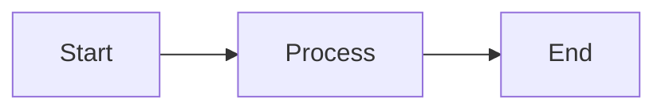

# FAQ & Troubleshooting
{: .no_toc }

Common questions and solutions for CourseWagon users and developers.
{: .fs-6 .fw-300 }

## Table of Contents
{: .no_toc .text-delta }

1. TOC
{:toc}

---

## General Questions

### What is CourseWagon?

CourseWagon is an AI-powered educational platform that helps educators and learners create comprehensive course content quickly. Using Google Gemini AI, it automatically generates course subjects, topics, and detailed lesson content with examples, diagrams, and exercises.

### Is CourseWagon free to use?

CourseWagon is currently in beta and free to use. Future pricing plans may be introduced for advanced features or higher usage limits.

### What makes CourseWagon different?

- **AI-Powered**: Automatic content generation using Google Gemini AI
- **Comprehensive**: Complete course structure from subjects to detailed content
- **Rich Content**: Supports Markdown, LaTeX math, Mermaid diagrams, and code highlighting
- **Modern Stack**: Built with Angular 19 and FastAPI for performance
- **Open Source**: Community-driven development

### Who should use CourseWagon?

- **Educators**: Create course materials quickly
- **Students**: Organize learning content
- **Self-learners**: Structure personal learning paths
- **Content Creators**: Generate educational content
- **Organizations**: Build training materials

---

## Account & Authentication

### How do I create an account?

1. Visit [www.coursewagon.live](https://www.coursewagon.live)
2. Click "Get Started" or "Login"
3. Choose "Sign Up" tab
4. Enter email and password
5. Verify your email

### I forgot my password. How do I reset it?

1. Click "Forgot Password?" on login page
2. Enter your email address
3. Check email for reset link
4. Click link and create new password
5. Log in with new password

### Why am I not receiving the password reset email?

**Check these common issues:**
- Email in spam/junk folder
- Incorrect email address entered
- Email service delays (wait 5-10 minutes)
- Email provider blocking automated emails

**Solutions:**
- Add `contact@coursewagon.live` to contacts
- Check all email folders
- Try again after waiting
- Contact support if issue persists

### Can I change my email address?

Yes! Go to your Profile and update your email. You'll need to verify the new email address.

### How do I delete my account?

Contact support at [contact@coursewagon.live](mailto:contact@coursewagon.live) to request account deletion. All your data will be permanently removed.

---

## Course Creation & Management

### How many courses can I create?

There's no limit! Create as many courses as you need.

### Can I share my courses with others?

Currently, courses are private to your account. Course sharing and collaboration features are planned for future releases.

### How do I organize my courses?

Courses follow this hierarchy:
```
Course → Subject → Topic → Content
```

Best practices:
- Use descriptive course titles
- Keep subjects focused (5-10 per course)
- Break subjects into manageable topics (5-15 per subject)
- One detailed lesson per topic

### Can I export my course content?

Export functionality is planned for a future release. You'll be able to export in:
- Markdown format
- PDF format
- HTML format

### What happens if I delete a course?

**Warning**: Deleting a course is permanent and will remove:
- All subjects in the course
- All topics in those subjects
- All content for those topics
- This action cannot be undone

---

## AI Content Generation

### How does AI content generation work?

CourseWagon uses Google Gemini AI (gemini-2.0-flash model) to generate educational content. You provide the course topic, and AI generates:
- Relevant subjects
- Detailed topics
- Comprehensive lesson content with examples, diagrams, and exercises

### How accurate is the AI-generated content?

Google Gemini AI is highly capable, but:
- **Always review** generated content for accuracy
- **Use as a starting point** and supplement with authoritative sources
- **Subject matter expertise** is still valuable
- **Regenerate** if content doesn't meet your needs

### Why is content generation taking so long?

**Normal generation times:**
- Subjects: 10-30 seconds
- Topics: 15-45 seconds
- Content: 30-90 seconds

**If it's taking longer:**
- High API usage (wait and try again)
- Large content generation
- Network connectivity issues
- Server load

### Content generation failed. What should I do?

**Try these steps:**
1. Refresh the page
2. Wait a moment and try again
3. Check your internet connection
4. Try generating fewer items at once
5. Contact support if problem persists

### Can I edit AI-generated content?

Manual content editing is coming in a future release. Currently, you can:
- Regenerate content to get different results
- Content is stored as Markdown (editable in database)
- Future releases will have in-app editor

### How many subjects/topics should I generate?

**Recommended:**
- **Subjects**: 5-10 per course
- **Topics**: 5-15 per subject

More isn't always better! Focus on quality and logical organization.

### Can I generate content in different languages?

Currently, content is primarily generated in English. Multi-language support is planned for future releases.

---

## Content Rendering

### Why aren't my math equations displaying correctly?

**Common issues:**
- Incorrect LaTeX syntax
- Missing dollar signs ($  or $$)
- Browser compatibility

**Solutions:**
```markdown
# Inline math
The equation $E = mc^2$ is famous.

# Display math
$$
\frac{-b \pm \sqrt{b^2 - 4ac}}{2a}
$$
```

Use Chrome or Firefox for best compatibility.

### Diagrams aren't rendering. What's wrong?

**For Mermaid diagrams:**
1. Verify syntax is correct
2. Refresh the page
3. Check browser console for errors
4. Try regenerating content

**Example working diagram:**
````markdown

````

### Code blocks don't have syntax highlighting

**Ensure you specify the language:**
````markdown
```python
def hello():
    print("Hello, World!")
```
````

Supported: Python, JavaScript, TypeScript, Java, C++, HTML, CSS, SQL, and more.

### How do I add images to content?

Currently, image upload is available through the image upload feature. AI can also generate images for topics. Manual image insertion in content is coming in a future release.

---

## Technical Issues

### The website is slow or not loading

**Check:**
- Internet connection
- Browser cache (try clearing it)
- Server status (check [status page](https://www.coursewagon.live))
- Browser compatibility (use latest Chrome/Firefox)

**Try:**
- Refresh the page (Ctrl+F5 or Cmd+Shift+R)
- Clear browser cache and cookies
- Try a different browser
- Disable browser extensions

### I'm getting "401 Unauthorized" errors

**This means your session expired:**
1. Log out completely
2. Clear browser cache
3. Log back in
4. Try your action again

If problem persists, check:
- Correct email/password
- Email is verified
- Account is active

### "500 Internal Server Error" - What does this mean?

This is a server-side error. Usually temporary:
1. Wait a few minutes
2. Try again
3. If persists, contact support

We're automatically notified of server errors and work to fix them quickly.

### My course list isn't loading

**Try:**
1. Refresh the page
2. Log out and log back in
3. Clear browser cache
4. Check console for errors (F12)

**If issue persists:**
- Contact support with screenshot
- Include browser and OS information

---

## Features & Functionality

### Does CourseWagon work on mobile?

Yes! CourseWagon is fully responsive and works on:
- 📱 Smartphones (iOS and Android)
- 📱 Tablets
- 💻 Desktop computers
- 🖥️ All modern browsers

### Can I work offline?

Currently, CourseWagon requires an internet connection. Offline support with Progressive Web App (PWA) features is planned for future releases.

### Does CourseWagon have a mobile app?

Not yet, but:
- Mobile web experience is fully optimized
- Native mobile apps are under consideration
- PWA version is planned

### Can multiple users collaborate on a course?

Collaboration features are planned but not yet available. Coming features:
- Share courses with other users
- Collaborative editing
- Comments and feedback
- Role-based permissions

### How do I track my learning progress?

The Learning View includes progress tracking:
- Mark topics as complete
- Visual progress indicators
- Resume where you left off

More advanced analytics are coming in future releases.

---

## Privacy & Security

### Is my data secure?

Yes! We implement multiple security measures:
- **HTTPS/TLS encryption** for all data transmission
- **Password hashing** with bcrypt
- **JWT token authentication**
- **Secure cloud storage** (GCS/Azure)
- **Regular security audits**

### Who can see my courses?

Only you! Your courses are private by default:
- Not visible to other users
- Not indexed by search engines
- Only accessible to your account

### How is my data stored?

- **Course data**: MySQL database (encrypted at rest)
- **Images**: Google Cloud Storage or Azure Blob Storage
- **Backups**: Automated daily backups
- **Location**: Cloud data centers (US/EU)

### Do you sell my data?

**Never.** We do not:
- Sell user data
- Share data with third parties (except service providers)
- Use data for advertising

We only use your data to provide CourseWagon services.

### How do I request my data?

Email [contact@coursewagon.live](mailto:contact@coursewagon.live) to request:
- Export of all your data
- Data deletion (right to be forgotten)
- Privacy information

We respond within 30 days per GDPR requirements.

---

## Development & Contributing

### How can I contribute to CourseWagon?

We welcome contributions! See the [Developer Guide](developer-guide) for:
- Setting up development environment
- Coding standards
- Submitting pull requests
- Reporting bugs

### Where is the source code?

GitHub: [github.com/Uttam-Mahata/coursewagon](https://github.com/Uttam-Mahata/coursewagon)

### What license is CourseWagon under?

MIT License - free to use, modify, and distribute.

### I found a bug. How do I report it?

1. Check [existing issues](https://github.com/Uttam-Mahata/coursewagon/issues)
2. If not reported, [create new issue](https://github.com/Uttam-Mahata/coursewagon/issues/new)
3. Include:
   - Detailed description
   - Steps to reproduce
   - Expected vs actual behavior
   - Screenshots if applicable
   - Browser and OS info

### How can I request a feature?

1. Check [existing feature requests](https://github.com/Uttam-Mahata/coursewagon/issues?q=is%3Aissue+is%3Aopen+label%3Aenhancement)
2. If not requested, open a new issue with `enhancement` label
3. Describe the feature and use case
4. Upvote existing requests you'd like to see

---

## Troubleshooting Guide

### Authentication Issues

**Problem**: Can't log in  
**Solutions**:
- Verify email and password are correct
- Check Caps Lock is off
- Try password reset
- Clear browser cache
- Disable browser extensions

**Problem**: Session keeps expiring  
**Solutions**:
- Check system time is correct
- Allow cookies for coursewagon.live
- Try different browser
- Clear browser cache

### Content Generation Issues

**Problem**: Generation stuck or fails  
**Solutions**:
- Wait and try again (API might be busy)
- Refresh the page
- Try generating fewer items
- Check internet connection
- Contact support if persists

**Problem**: Generated content is irrelevant  
**Solutions**:
- Use more specific course/subject titles
- Add detailed course description
- Regenerate for different results
- Try generating one section at a time

### Display Issues

**Problem**: Layout looks broken  
**Solutions**:
- Clear browser cache
- Update browser to latest version
- Try different browser
- Disable browser extensions
- Check browser zoom (should be 100%)

**Problem**: Images not loading  
**Solutions**:
- Check internet connection
- Refresh the page
- Clear browser cache
- Check browser console for errors

### Performance Issues

**Problem**: Website is slow  
**Solutions**:
- Check internet speed
- Close other tabs/applications
- Clear browser cache
- Try different time of day
- Contact support if consistently slow

---

## Best Practices

### For Creating Courses

1. **Start with clear structure**
   - Define course goals
   - Outline main topics
   - Plan progression

2. **Use descriptive names**
   - Clear course titles
   - Specific subject names
   - Focused topic names

3. **Review AI content**
   - Always verify accuracy
   - Add your expertise
   - Supplement with sources

4. **Organize logically**
   - Sequential learning path
   - Prerequisite topics first
   - Build complexity gradually

### For Using AI Generation

1. **Be specific**
   - Detailed course descriptions
   - Clear learning objectives
   - Standard terminology

2. **Generate progressively**
   - Don't generate everything at once
   - Review each section
   - Adjust as needed

3. **Iterate**
   - Regenerate if needed
   - Combine AI and manual content
   - Refine over time

### For Content Quality

1. **Verify information**
   - Check facts and figures
   - Validate examples
   - Test code snippets

2. **Add context**
   - Real-world applications
   - Relevant examples
   - Current best practices

3. **Keep updated**
   - Regenerate outdated content
   - Add new developments
   - Remove deprecated information

---

## Known Limitations

### Current Limitations

- **No manual content editing** (coming soon)
- **No course sharing** (planned)
- **English only** (multi-language planned)
- **No offline mode** (PWA planned)
- **Limited export options** (more formats coming)

### API Rate Limits

- Content generation may be rate-limited during high usage
- Recommended: Wait between generations
- Contact support for higher limits

---

## Getting Help

### Support Channels

**Email Support**:
- 📧 [contact@coursewagon.live](mailto:contact@coursewagon.live)
- Response time: 24-48 hours
- Include detailed description and screenshots

**GitHub Issues**:
- 🐛 [Bug Reports](https://github.com/Uttam-Mahata/coursewagon/issues)
- ✨ [Feature Requests](https://github.com/Uttam-Mahata/coursewagon/issues)
- Public discussion and tracking

**GitHub Discussions**:
- 💬 [General Questions](https://github.com/Uttam-Mahata/coursewagon/discussions)
- Community support
- Share ideas and feedback

**Documentation**:
- 📖 [Getting Started](getting-started)
- 🏗️ [System Architecture](architecture)
- 💻 [Developer Guide](developer-guide)
- 🚀 [Deployment Guide](deployment)

### When Contacting Support

**Include:**
- Detailed description of issue
- Steps to reproduce
- Expected vs actual behavior
- Screenshots or screen recordings
- Browser and OS information
- Any error messages

**Example:**
```
Subject: Content Generation Failing

Description:
I'm unable to generate content for topics in my "Web Development" course.

Steps to reproduce:
1. Open course "Web Development"
2. Navigate to subject "HTML Basics"
3. Click on topic "HTML Tags"
4. Click "Generate Content"
5. Loading spinner appears but never completes

Expected: Content should generate in 30-60 seconds
Actual: Loading spinner continues indefinitely

Browser: Chrome 120.0.6099.129
OS: macOS 14.2
Screenshot: [attached]
```

---

## What's Next?

- [User Guide](user-guide) - Learn how to use all features
- [API Reference](api-reference) - Integrate with CourseWagon
- [Developer Guide](developer-guide) - Contribute to the project

---

**Still have questions?** Contact us at [contact@coursewagon.live](mailto:contact@coursewagon.live)
