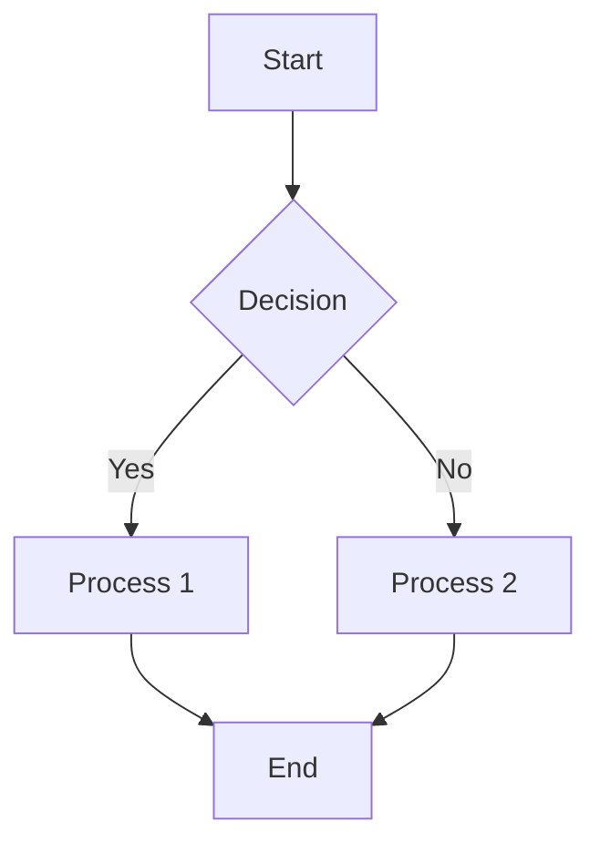
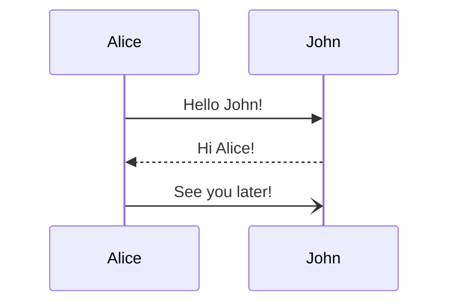
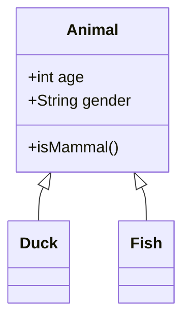
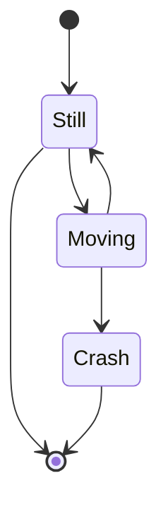
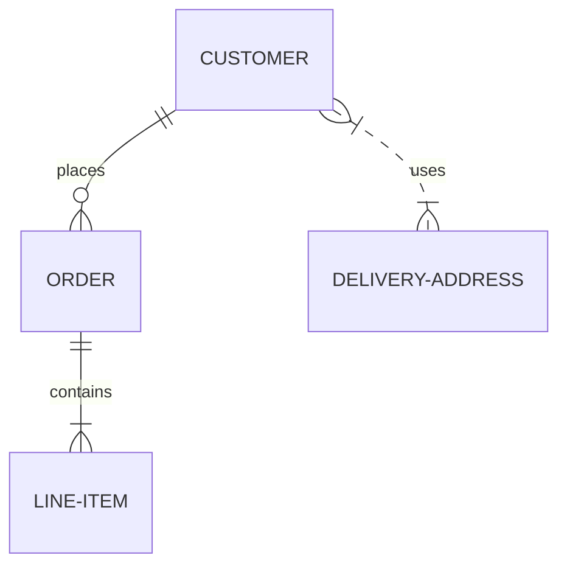

# Features
{: .no_toc }

Explore all the powerful features that make CourseWagon unique.
{: .fs-6 .fw-300 }

## Table of Contents
{: .no_toc .text-delta }

1. TOC
{:toc}

---

## AI-Powered Content Generation

### Automatic Subject Generation

Generate comprehensive course subjects using Google Gemini AI.

**How it works:**
1. Provide your course title and description
2. Specify number of subjects (5-10 recommended)
3. AI analyzes and generates relevant subjects
4. Review and accept or regenerate

**Example:** For "Web Development", AI generates:
- HTML Basics
- CSS Styling
- JavaScript Fundamentals
- Responsive Design
- Web APIs & AJAX
- Frontend Frameworks
- Backend Development
- Database Integration

### Intelligent Topic Generation

Break down subjects into detailed, manageable topics.

**Features:**
- Context-aware topic generation
- Logical progression and sequencing
- Comprehensive coverage of subject matter
- 5-15 topics per subject

**Example:** For "JavaScript Fundamentals", AI generates:
- Variables and Data Types
- Operators and Expressions
- Control Flow Statements
- Functions and Scope
- Arrays and Objects
- DOM Manipulation
- Event Handling
- Asynchronous JavaScript

### Rich Content Creation

Generate detailed, educational content with multiple components.

**Content includes:**

**📚 Core Concepts**
- Clear definitions and explanations
- Key principles and theories
- Historical context and evolution
- Best practices and standards

**💡 Examples**
- Real-world applications
- Step-by-step walkthroughs
- Multiple scenarios
- Industry use cases

**📐 Mathematical Content**
- LaTeX-formatted equations
- Inline math: $E = mc^2$
- Display math: $$\int_0^\infty e^{-x^2}dx$$
- Step-by-step derivations
- Formula explanations

**💻 Code Examples**
- Syntax highlighting with Prism.js
- Multiple programming languages
- Commented code
- Best practices
- Common patterns

**📊 Visual Diagrams**
Using Mermaid.js:
- Flowcharts
- Sequence diagrams
- Class diagrams
- State diagrams
- Entity-relationship diagrams
- Gantt charts
- Pie charts
- Mind maps
- And many more

**✅ Practice Material**
- Review questions
- Exercises and problems
- Real-world challenges
- Self-assessment tools

---

## Course Management

### Comprehensive Course Structure

**Hierarchical Organization:**
```
Course
├── Subject 1
│   ├── Topic 1 → Content
│   ├── Topic 2 → Content
│   └── Topic 3 → Content
├── Subject 2
│   └── Topics...
└── Subject 3
    └── Topics...
```

### Course Operations

**Create Courses**
- Unlimited course creation
- Rich text descriptions
- Custom categorization
- Metadata management

**Edit Courses**
- Update title and description
- Reorganize structure
- Add/remove subjects
- Reorder content

**Delete Courses**
- Cascade deletion
- Confirmation prompts
- Data cleanup
- Permanent removal

### Course Dashboard

**Visual Overview**
- Grid or list view
- Course cards with previews
- Quick access buttons
- Status indicators

**Search and Filter**
- Search by title
- Filter by date
- Sort by various criteria
- Pagination support

---

## Content Rendering

### Markdown Support

Full GitHub Flavored Markdown (GFM) support:

**Text Formatting:**
```markdown
**Bold text**
*Italic text*
***Bold and italic***
~~Strikethrough~~
`Inline code`
```

**Headings:**
```markdown
# H1 Heading
## H2 Heading
### H3 Heading
```

**Lists:**
```markdown
- Bullet list
  - Nested item
  - Another item

1. Numbered list
2. Second item
   1. Nested number
```

**Links and Images:**
```markdown
[Link text](https://example.com)

```

**Tables:**
```markdown
| Column 1 | Column 2 |
|----------|----------|
| Data 1   | Data 2   |
```

**Blockquotes:**
```markdown
> This is a quote
> Multiple lines
```

**Code Blocks:**
````markdown
```python
def hello_world():
    print("Hello, World!")
```
````

### Mathematical Equations

**KaTeX Rendering:**
- Fast, lightweight math rendering
- Perfect for inline equations
- Beautiful typography

**MathJax Rendering:**
- Complex equation support
- Advanced mathematical notation
- Flexible configuration

**LaTeX Syntax:**
```latex
# Inline math
$E = mc^2$

# Display math
$$
\frac{-b \pm \sqrt{b^2 - 4ac}}{2a}
$$

# Complex equations
$$
\int_{-\infty}^{\infty} e^{-x^2} dx = \sqrt{\pi}
$$
```

### Diagram Rendering

**Mermaid.js Integration:**

All diagram types supported:

**Flowchart:**


**Sequence Diagram:**


**Class Diagram:**


**State Diagram:**


**Entity Relationship:**


### Code Syntax Highlighting

**Prism.js Integration:**

Supports 200+ programming languages:
- Python
- JavaScript/TypeScript
- Java
- C/C++/C#
- HTML/CSS
- SQL
- PHP
- Ruby
- Go
- Rust
- Swift
- Kotlin
- And many more

**Features:**
- Line numbers
- Line highlighting
- Copy button (coming soon)
- Theme support
- Auto-detection

---

## Learning Experience

### Learning View

**Immersive Reading Experience:**

**Distraction-Free Interface:**
- Clean, focused layout
- Minimal UI elements
- Full-screen mode
- Dark mode (coming soon)

**Smart Navigation:**
- Sidebar topic list
- Previous/Next buttons
- Keyboard shortcuts (coming soon)
- Progress indicators

**Mobile Optimized:**
- Responsive design
- Touch-friendly controls
- Collapsible sidebar
- Optimized fonts and spacing

### Progress Tracking

**Track Your Learning:**
- Mark topics as complete
- Visual progress bars
- Completion percentage
- Resume functionality

**Coming Soon:**
- Learning streaks
- Time spent tracking
- Completion certificates
- Learning analytics

---

## Authentication & Security

### Firebase Authentication

**Sign-Up Methods:**
- Email and password
- Google Sign-In (coming soon)
- GitHub Sign-In (coming soon)
- Email verification

**Security Features:**
- Secure password hashing
- JWT token authentication
- Automatic session management
- Refresh token rotation

**Password Management:**
- Password reset via email
- Strong password requirements
- Secure password storage
- Password change functionality

### Authorization

**Role-Based Access:**
- User role
- Admin role
- Custom permissions
- Protected routes

**Access Control:**
- AuthGuard for protected routes
- AdminGuard for admin routes
- NonAuthGuard for public routes
- API-level authorization

---

## Cloud Storage

### Multi-Cloud Strategy

**Primary Storage: Google Cloud Storage**
- High performance
- Global CDN
- 99.9% availability
- Pay-per-use pricing

**Fallback: Azure Blob Storage**
- Automatic failover
- High redundancy
- Global distribution
- Cost-effective

**Final Fallback: Firebase Storage**
- Integrated authentication
- Easy configuration
- Reliable backup
- Simple API

**Unified Interface:**
- Seamless switching
- Automatic retry
- Error handling
- Consistent API

### Image Management

**Upload Features:**
- Drag and drop (coming soon)
- Multiple file formats (JPEG, PNG, GIF, WebP)
- Size validation
- Automatic optimization

**AI Image Generation:**
- Generate images with Gemini AI
- Custom prompts
- High-quality output
- Automatic storage

---

## Email Notifications

### Automated Emails

**Welcome Emails:**
- Sent on registration
- Professional HTML template
- Getting started guide
- Support information

**Password Reset:**
- Secure token generation
- Expiring links
- Clear instructions
- Support contact

**Notifications:**
- Course updates
- System announcements
- Feature releases
- Maintenance notices

### Dual Email Providers

**Primary: Gmail SMTP**
- Reliable delivery
- Fast sending
- High reputation
- Easy configuration

**Backup: Mailgun**
- Automatic failover
- API-based sending
- Delivery tracking
- Advanced analytics

---

## Admin Features

### User Management

**Admin Dashboard:**
- View all users
- Search and filter
- Sort by various criteria
- Pagination

**User Operations:**
- Grant/revoke admin status
- View user details
- Delete users
- Monitor activity

### Testimonial Management

**Review Testimonials:**
- View all submissions
- Approve/reject reviews
- Edit testimonials
- Delete inappropriate content

**Display Management:**
- Choose featured reviews
- Sort by rating
- Filter by status
- Moderate content

---

## API & Integration

### RESTful API

**Comprehensive Endpoints:**
- Authentication
- Course management
- Content generation
- User management
- Admin operations

**API Documentation:**
- Swagger UI
- ReDoc interface
- Interactive testing
- Request/response examples

**Authentication:**
- JWT bearer tokens
- Refresh token flow
- Token expiration
- Secure headers

---

## Performance Features

### Frontend Optimization

**Angular Optimizations:**
- Standalone components
- Lazy loading
- AOT compilation
- Tree shaking
- Code splitting

**Caching:**
- Browser caching
- Service worker (coming soon)
- API response caching (coming soon)

### Backend Optimization

**FastAPI Performance:**
- Async/await support
- Automatic request validation
- Dependency injection
- Connection pooling

**Database:**
- Query optimization
- Indexed columns
- Connection pooling
- Prepared statements

---

## Responsive Design

### Mobile-First Approach

**Breakpoints:**
- Mobile: < 768px
- Tablet: 768px - 1024px
- Desktop: > 1024px
- Wide: > 1440px

**Touch Optimization:**
- Touch-friendly buttons
- Swipe gestures (coming soon)
- Mobile navigation
- Optimized forms

**Adaptive Layout:**
- Flexible grids
- Responsive typography
- Adaptive images
- Context-aware UI

---

## Accessibility

### WCAG Compliance (In Progress)

**Current Features:**
- Semantic HTML
- Alt text for images
- Keyboard navigation
- Focus indicators

**Coming Soon:**
- Screen reader support
- ARIA labels
- High contrast mode
- Adjustable font sizes

---

## Coming Soon

### Planned Features

**Content Management:**
- ✨ Manual content editing
- 📝 Rich text editor
- 🖼️ Image insertion in content
- 📁 File attachments
- 🔄 Version history

**Collaboration:**
- 👥 Course sharing
- 🤝 Multi-user editing
- 💬 Comments and feedback
- 📧 Invite collaborators

**Learning Features:**
- 🎯 Quizzes and assessments
- 📊 Learning analytics
- 🏆 Achievements and badges
- 📈 Progress reports
- 🎥 Video integration

**Export Options:**
- 📄 PDF export
- 📝 Markdown export
- 🌐 HTML export
- 📦 SCORM packages

**Advanced Features:**
- 🔍 Full-text search
- 🌍 Multi-language support
- 🎨 Custom themes
- 📱 Mobile apps
- 🔌 Third-party integrations

**AI Enhancements:**
- 🤖 Chat with AI tutor
- 🎯 Personalized learning paths
- 📊 Content recommendations
- 🔄 Auto-updates for outdated content

---

## Feature Comparison

### Free vs. Premium (Future)

Current features are **all free** during beta.

**Planned Free Tier:**
- 10 courses
- AI generation (limited)
- Basic features
- Community support

**Planned Premium:**
- Unlimited courses
- Priority AI generation
- Advanced analytics
- Priority support
- Export features
- Collaboration tools

---

## Technology Stack

### Frontend Technologies

- **Framework**: Angular 19
- **Language**: TypeScript
- **Styling**: Tailwind CSS 4.1
- **Markdown**: ngx-markdown
- **Math**: KaTeX + MathJax
- **Diagrams**: Mermaid.js
- **Syntax**: Prism.js
- **Icons**: Font Awesome
- **Auth**: Firebase Auth

### Backend Technologies

- **Framework**: FastAPI
- **Language**: Python 3.10+
- **Database**: MySQL 8.0
- **ORM**: SQLAlchemy
- **AI**: Google Gemini AI
- **Storage**: GCS, Azure, Firebase
- **Email**: Gmail SMTP, Mailgun
- **Auth**: JWT, Firebase Admin SDK

### Infrastructure

- **Frontend Hosting**: Firebase Hosting
- **Backend**: Google Cloud Run
- **Database**: Cloud SQL / Azure MySQL
- **Storage**: Multi-cloud
- **CI/CD**: GitHub Actions
- **Monitoring**: Cloud Monitoring

---

## Need More Information?

- [Getting Started](getting-started) - Set up your environment
- [User Guide](user-guide) - Learn how to use CourseWagon
- [API Reference](api-reference) - Integrate with the API
- [Developer Guide](developer-guide) - Contribute to the project
