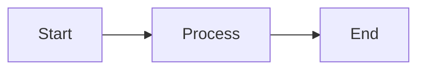

# User Guide
{: .no_toc }

Learn how to use CourseWagon to create and manage educational content.
{: .fs-6 .fw-300 }

## Table of Contents
{: .no_toc .text-delta }

1. TOC
{:toc}

---

## Getting Started with CourseWagon

CourseWagon is an AI-powered educational platform that helps you create comprehensive course content quickly and efficiently. This guide will walk you through all the features available.

---

## Creating an Account

### Sign Up

1. Visit [www.coursewagon.live](https://www.coursewagon.live)
2. Click **"Get Started"** or **"Login"** button
3. Choose **"Sign Up"** tab
4. Enter your email address and password
5. Click **"Sign Up"**
6. Check your email for a welcome message

### Sign In

1. Click **"Login"** button
2. Enter your email and password
3. Click **"Sign In"**
4. You'll be redirected to your dashboard

### Password Reset

If you forget your password:

1. Click **"Forgot Password?"** on the login page
2. Enter your email address
3. Check your email for reset instructions
4. Click the reset link and create a new password

---

## Course Management

### Creating Your First Course

1. **Navigate to Dashboard**
   - After logging in, you'll see your dashboard
   - Click **"Create New Course"** button

2. **Enter Course Details**
   - **Title**: Give your course a descriptive name (e.g., "Web Development Fundamentals")
   - **Description**: Briefly describe what students will learn
   - Click **"Create Course"**

3. **Your course is created!**
   - You'll see your new course in the course list
   - Click on the course to start adding content

### Viewing Your Courses

- **Dashboard**: Shows all your courses in a grid layout
- **Course Cards**: Display course title, description, and creation date
- **Actions**: Click on a course card to view details or edit

### Editing a Course

1. Click on a course from your dashboard
2. Click **"Edit Course"** button
3. Update title or description
4. Click **"Save Changes"**

### Deleting a Course

1. Navigate to the course you want to delete
2. Click **"Delete Course"** button
3. Confirm the deletion
4. **Warning**: This will delete all subjects, topics, and content within the course

---

## Subject Management

Subjects are major sections within your course (e.g., "HTML Basics", "CSS Styling").

### Generating Subjects with AI

CourseWagon can automatically generate relevant subjects for your course using AI:

1. **Open your course**
2. Click **"Generate Subjects"** button
3. **Choose number of subjects** (recommended: 5-10)
4. Click **"Generate"**
5. **Wait for AI to generate** (typically 10-30 seconds)
6. **Review generated subjects**

**Example**: For a "Web Development" course, AI might generate:
- HTML Basics
- CSS Styling
- JavaScript Fundamentals
- Responsive Design
- Web APIs

### Manually Adding Subjects

1. Click **"Add Subject"** button
2. Enter subject name
3. Set order (for organizing sequence)
4. Click **"Create"**

### Editing Subjects

1. Click the edit icon next to a subject
2. Update the name or order
3. Click **"Save"**

### Deleting Subjects

1. Click the delete icon next to a subject
2. Confirm deletion
3. **Warning**: This will delete all topics and content within the subject

---

## Topic Management

Topics are specific lessons within a subject (e.g., "HTML Tags", "CSS Selectors").

### Generating Topics with AI

1. **Open a subject** by clicking on it
2. Click **"Generate Topics"** button
3. **Choose number of topics** (recommended: 5-15 per subject)
4. Click **"Generate"**
5. **Wait for AI generation** (typically 15-45 seconds)
6. **Review generated topics**

**Example**: For "HTML Basics" subject, AI might generate:
- Introduction to HTML
- HTML Document Structure
- Common HTML Tags
- Semantic HTML
- HTML Forms
- HTML Tables
- HTML Media Elements

### Manually Adding Topics

1. Within a subject, click **"Add Topic"**
2. Enter topic name
3. Set order
4. Click **"Create"**

### Topic Status

Topics show different statuses:
- **No Content** (gray): Content not yet generated
- **Has Content** (green checkmark): Content available

---

## Content Generation

This is where CourseWagon's AI truly shines - generating detailed, comprehensive lesson content.

### Generating Content for a Topic

1. **Click on a topic** from the topic list
2. You'll see the content view
3. If no content exists, click **"Generate Content"** button
4. **Wait for AI to generate** (typically 30-60 seconds)
5. **Content appears automatically** with:
   - Detailed explanations
   - Real-world examples
   - Code snippets with syntax highlighting
   - Mathematical equations (when relevant)
   - Diagrams and visualizations
   - Practice questions

### What's Included in Generated Content?

CourseWagon's AI generates comprehensive educational content:

**📚 Core Concepts**
- Clear definitions and explanations
- Key principles and theories
- Historical context when relevant

**💡 Examples**
- Real-world applications
- Numerical examples with step-by-step solutions
- Code examples with multiple languages

**📐 Mathematical Content**
- LaTeX-formatted equations
- Both inline ($x = y$) and display ($$\frac{a}{b}$$) math
- Step-by-step mathematical derivations

**🎨 Visual Diagrams**
- Flowcharts
- Sequence diagrams
- Class diagrams
- Entity-relationship diagrams
- Mind maps
- And many more (using Mermaid.js)

**💻 Code Examples**
- Syntax highlighting
- Multiple programming languages
- Commented explanations

**✅ Practice Material**
- Review questions
- Exercises
- Real-world problems

### Updating Content

1. Navigate to a topic with existing content
2. Click **"Regenerate Content"** to create fresh content
3. Or click **"Edit Content"** to manually modify (future feature)

---

## Learning View

The Learning View provides a focused, distraction-free environment for studying.

### Accessing Learning View

1. Click on a course
2. Click **"Start Learning"** or **"Learning View"** button
3. You'll enter a full-screen learning interface

### Learning View Features

**📚 Sidebar Navigation**
- See all subjects and topics
- Track progress with checkmarks
- Quick topic switching

**📖 Content Display**
- Clean, readable layout
- Proper rendering of:
  - Markdown formatting
  - Mathematical equations
  - Code blocks with syntax highlighting
  - Interactive diagrams
  - Images and media

**🎯 Progress Tracking**
- Mark topics as complete
- Visual progress indicators
- Resume where you left off

**📱 Mobile Responsive**
- Collapsible sidebar on mobile
- Touch-friendly navigation
- Optimized for all screen sizes

### Navigating Between Topics

- **Previous/Next buttons**: Navigate sequentially through topics
- **Sidebar**: Jump to any topic directly
- **Keyboard shortcuts** (future feature):
  - Left Arrow: Previous topic
  - Right Arrow: Next topic

---

## Content Rendering

CourseWagon supports rich content formatting.

### Markdown Support

All content supports standard Markdown:

```markdown
# Heading 1
## Heading 2
### Heading 3

**Bold text**
*Italic text*
`Inline code`

- Bullet list
- Another item

1. Numbered list
2. Second item

[Link text](https://example.com)

```

### Mathematical Equations

**Inline Math**: Use single dollar signs
```
The equation $E = mc^2$ is famous.
```

**Display Math**: Use double dollar signs
```
$$
\int_{0}^{\infty} e^{-x^2} dx = \frac{\sqrt{\pi}}{2}
$$
```

### Code Blocks

Use triple backticks with language specification:

````markdown
```python
def hello_world():
    print("Hello, World!")
```
````

Supported languages include: Python, JavaScript, Java, C++, HTML, CSS, and many more.

### Diagrams

Mermaid.js diagrams are automatically rendered:

````markdown

````

---

## Profile Management

### Viewing Your Profile

1. Click on your profile icon in the header
2. Select **"Profile"**
3. View your account information

### Updating Profile

1. Go to your profile
2. Click **"Edit Profile"**
3. Update your name or email
4. Click **"Save Changes"**

---

## Writing Reviews

Help others by sharing your experience with CourseWagon:

1. Navigate to **"Write Review"** from the menu
2. Enter your review text
3. Select a rating (1-5 stars)
4. Click **"Submit Review"**
5. Your review will be visible after admin approval

---

## Tips for Best Results

### Creating Effective Courses

1. **Clear Titles**: Use descriptive, specific course titles
2. **Comprehensive Descriptions**: Help AI understand your course scope
3. **Logical Structure**: Organize subjects in a learning sequence
4. **Appropriate Topic Count**: 5-15 topics per subject works well
5. **Review Generated Content**: AI is powerful but review for accuracy

### Working with AI Generation

**For Better AI Results:**
- Use specific, descriptive course titles
- Provide detailed course descriptions
- Use standard subject names when possible
- Generate content in batches (don't generate all at once)
- Review and regenerate if content isn't quite right

**AI Generation Time:**
- Subjects: ~10-30 seconds
- Topics: ~15-45 seconds  
- Content: ~30-90 seconds

### Content Organization

1. **Start with Course Structure**
   - Create course
   - Generate/add subjects
   - Generate/add topics
   - Then generate content

2. **Progressive Development**
   - Don't generate all content at once
   - Generate as you need it
   - This saves time and resources

3. **Review and Iterate**
   - Review AI-generated subjects
   - Adjust order for logical flow
   - Regenerate content if needed

---

## Keyboard Shortcuts

**Coming Soon**: Keyboard shortcuts for faster navigation

- `Ctrl/Cmd + K`: Quick search
- `←`: Previous topic (in learning view)
- `→`: Next topic (in learning view)
- `M`: Toggle sidebar (in learning view)

---

## Mobile Usage

CourseWagon is fully responsive and works great on mobile devices:

**📱 Mobile Features:**
- Touch-friendly interface
- Collapsible navigation
- Optimized content rendering
- Full feature parity with desktop

**📲 Recommended:**
- Use Chrome or Safari for best experience
- Portrait mode for reading content
- Landscape mode for viewing diagrams

---

## Common Questions

### How accurate is the AI-generated content?

The AI (Google Gemini) is highly capable and generates quality educational content. However:
- Always review generated content for accuracy
- Use it as a starting point
- Supplement with authoritative sources
- Regenerate if content isn't suitable

### Can I edit generated content?

Currently, you can regenerate content but manual editing is coming soon. For now:
- Regenerate to get different content
- Content is saved in Markdown format
- Manual editing feature planned for future release

### How many courses can I create?

There's no limit! Create as many courses as you need.

### Is my content private?

Yes, your courses are private by default:
- Only you can see and edit your courses
- No one else can access your content
- You control all your educational material

### Can I export my content?

Export functionality is planned for a future release. It will support:
- Markdown export
- PDF export
- HTML export

---

## Troubleshooting

### Content Not Generating

If AI content generation fails:
1. **Check internet connection**
2. **Wait a moment and try again** (API might be busy)
3. **Refresh the page**
4. **Contact support** if issue persists

### Diagrams Not Rendering

If Mermaid diagrams don't display:
1. **Refresh the page**
2. **Check diagram syntax** (must be valid Mermaid.js)
3. **Regenerate content** for corrected diagram code

### Math Equations Not Rendering

If LaTeX equations don't display properly:
1. **Refresh the page**
2. **Check equation syntax** (must be valid LaTeX)
3. **Try different browser** (Chrome recommended)

---

## Getting Help

Need assistance?

- 📧 **Email**: [contact@coursewagon.live](mailto:contact@coursewagon.live)
- 🐛 **Bug Reports**: [GitHub Issues](https://github.com/Uttam-Mahata/coursewagon/issues)
- 💬 **Questions**: [GitHub Discussions](https://github.com/Uttam-Mahata/coursewagon/discussions)
- 📖 **Documentation**: [docs.coursewagon.live](https://uttam-mahata.github.io/coursewagon/)

---

## What's Next?

- [Developer Guide](developer-guide) - Contribute to CourseWagon
- [API Reference](api-reference) - Build integrations
- [FAQ](faq) - More answers to common questions
